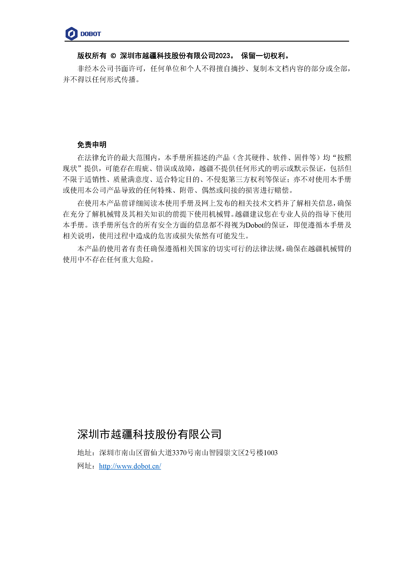

English version of the README -> please [click here](./README-EN.md)

# 0.Changelog
- V3.7-2023/12/27: 新增Pause、Continue两条指令。
- V3.6-2023/10/19: 新增RelPointUser、RelPointTool、SetHomeCalibration、SetGlobalVar、GetGlobalVar、SetAxisLimit、GetAxisLimit两条指令。
- V3.5-2023/09/26: 新增SetUser、SetTool、CalcUser、CalcTool这四条指令。
- V3.4-2023/08/03：修改modbus相关指令参数说明。
- V3.3-2023/07/19: 增加托盘两条指令PalletCreate GetPalletPose。
- V3.2-2023/06/16：针对开会评审意见修改文档格式以及排版。
- V3.1-2023/06/15：针对设置指令以及运动指令添加命令注释说明。
- V3.0-2023/06/14：基于原有TCP/IP文档进行梳理重构，输出初版。

# 1. 综述

- 越疆工业机器人现支持三种远程控制方式：**远程I/O模式、远程Modbus模式、TCP/IP模式**；具体控制方式详见《Dobot-CR-Series-Robot-APP-User-Guide文档中软件使用说明->设置->远程控制章节中；

- **远程I/O模式、远程Modbus模式两种方式主要针对远程运行脚本的控制**；由于基于TCP/IP的通讯具有成本低、可靠性高、实用性强、性能高等特点；许多工业自动化项目对支持TCP/IP协议控制机器人需求广泛，因此CR/Nova机器人将设计在TCP/IP协议的基础上，提供了丰富的接口用于与外部设备的交互；

- 关于TCP/IP协议的支持，CR系列机器人的控制器版本需V3.5.1.19及以上，Nova机器人的控制器版本需V3.5.3.0及以上。
- 根据设计，CR/Nova机器人会开启29999、30003、30004、30005以及30006服务器端口；
- 29999服务器端口和30003服务器端口，以下简称控制端口。通过一发一收的方式负责接收一些设置以及运动控制相关的指令，即**控制端口接收到客户端约定消息格式后会将结果反馈客户端**；
- 30004服务器端口(以下简称实时反馈端口)**每8ms反馈机器人的信息；**30005服务器端口**每200ms反馈机器人的信息**，30006端口为**可配置**的反馈机器人信息端口(默认为每**50ms**反馈)；

# 2.消息格式

- TCPIP远程控制指令**不区分大小写格式**；如ENABLEROBOT()/enablerobot()/eNabLErobOt()，指令控制器都会按照**使能**的命令执行；

- 消息命令与消息应答都是 ASCII 码格式(字符串形式)。

## 2.1 命令格式

​	`命令名称(Param1,Param2,Param3……Paramn)`

​	命令格式如上所示，由一个命令息名称，括号内由参数组成， 每一个参数之间以英文逗号  ”,”  相隔，一个完整的命令以右括号结束。

​	命令区分为队列指令和立即指令。详见指令列表中的指令类型。

## 2.2 返回格式

### 2.2.1 返回：

​	`"ErrorID,{value,...,valuen},命令名称(Param1,Param2,Param3……Paramn);"`

​	命令格式如上所示：

- ErrorID为0时表示命令接收成功；返回非0则代表命令有错误，具体的错误描述见第五章节。
- {value1,value2,value3,...,valuen}表示返回值，没有返回值则返回{}。
- 命令名称(Param1,Param2,Param3……Paramn)指下发的内容。

​	例：

​		MovL(-500,100,200,150,0,90)
​		返回：0,{},MovL(-500,100,200,150,0,90);   //0表示接收成功 没有返回值返回{}

​		Mov(-500,100,200,150,0,90);	//下发不存在指令
·		报警： -10000,{},Mov(-500,100,200,150,0,90);   //-10000表示命令错误  没有返回值返回{}

# 3.控制端口命令

- 上位机可以通过控制端口直接发送设置，运动相关的指令给机器人，这些命令被称为控制指令。如表是控制指令指令列表。可以通过控制指令的指令实现对机器人使能/下使能、复位等控制；

​	**控制端口设置命令列表如下：**

| 指令              | 描述                                                         | 支持产品 | 指令类型 |
| ----------------- | ------------------------------------------------------------ | -------- | -------- |
| EnableRobot       | 使能机器人                                                   | CR/Nova  | 立即指令 |
| DisableRobot      | 下使能机器人                                                 | CR/Nova  | 立即指令 |
| ClearError        | 复位，用于清除错误                                           | CR/Nova  | 立即指令 |
| ResetRobot        | 机器人停止当前动作，重新接收使能，规划停                     | CR/Nova  | 立即指令 |
| SpeedFactor       | 设置全局速率比                                               | CR/Nova  | 立即指令 |
| User              | 选择已标定的用户坐标系（笛卡尔空间显示值 实际生效根据点）    | CR/Nova  | 队列指令 |
| Tool              | 选择已标定的工具坐标系                                       | CR/Nova  | 队列指令 |
| RobotMode         | 机器人模式                                                   | CR/Nova  | 立即指令 |
| PayLoad           | 设置负载                                                     | CR/Nova  | 队列指令 |
| DO                | 设置数字量输出端口状态                                       | CR/Nova  | 队列指令 |
| DOExecute         | 设置数字量输出端口状态                                       | CR/Nova  | 立即指令 |
| ToolDO            | 设置末端数字量输出端口状态                                   | CR/Nova  | 队列指令 |
| ToolDOExecute     | 设置末端数字量输出端口状态                                   | CR/Nova  | 立即指令 |
| AO                | 设置模拟量输出端口状态                                       | CR/Nova  | 队列指令 |
| AOExecute         | 设置模拟量输出端口状态                                       | CR/Nova  | 立即指令 |
| AccJ              | 设置关节加速度比例。 该指令仅对MovJ、MovJIO、MovJR、 JointMovJ指令有效 | CR/Nova  | 队列指令 |
| AccL              | 设置笛卡尔加速度比例。 该指令仅对MovL、MovLIO、MovLR、Jump、Arc、Circle3指令有效。 | CR/Nova  | 队列指令 |
| SpeedJ            | 设置关节速度比例。 该指令仅对MovJ、MovJIO、MovJR、 JointMovJ指令有效。 | CR/Nova  | 队列指令 |
| SpeedL            | 设置笛卡尔速度比例。 该指令仅对MovL、MovLIO、MovLR、Jump、Arc、Circle3指令有效。 | CR/Nova  | 队列指令 |
| Arch              | 设置Jump门型参数索引（起始点抬升高度、最大抬升高度、结束点下降高度） | CR/Nova  | 队列指令 |
| CP                | 运动时设置平滑过渡                                           | CR/Nova  | 队列指令 |
| SetArmOrientation | 设置手系                                                     | CR/Nova  | 队列指令 |
| PowerOn           | 机器人上电                                                   | CR/Nova  | 立即指令 |
| RunScript         | 运行脚本                                                     | CR/Nova  | 立即指令 |
| StopScript        | 停止脚本                                                     | CR/Nova  | 立即指令 |
| PauseScript       | 暂停脚本                                                     | CR/Nova  | 立即指令 |
| ContinueScript    | 继续脚本                                                     | CR/Nova  | 立即指令 |
| SetSafeSkin       | 设置安全皮肤开关状态                                         | CR/Nova  | 队列指令 |
| GetTraceStartPose | 获取轨迹拟合中首个点位                                       | CR/Nova  | 立即指令 |
| GetPathStartPose  | 获取轨迹复现中首个点位                                       | CR/Nova  | 立即指令 |
| PositiveSolution  | 正解                                                         | CR/Nova  | 立即指令 |
| InverseSolution   | 逆解                                                         | CR/Nova  | 立即指令 |
| SetCollisionLevel | 设置碰撞等级                                                 | CR/Nova  | 队列指令 |
| HandleTrajPoints  | 轨迹文件预处理                                               | CR/Nova  | 立即指令 |
| GetSixForceData   | 获取六维力数据                                               | CR/Nova  | 立即指令 |
| GetAngle          | 获取关节坐标系下机械臂的实时位姿                             | CR/Nova  | 立即指令 |
| GetPose           | 获取笛卡尔坐标系下机械臂的实时位姿                           | CR/Nova  | 立即指令 |
| EmergencyStop     | 急停                                                         | CR/Nova  | 立即指令 |
| ModbusCreate      | 创建Modbus主站，并和从站建立连接                             | CR/Nova  | 立即指令 |
| ModbusClose       | 和Modbus从站断开连接                                         | CR/Nova  | 立即指令 |
| GetInBits         | 读离散输入功能                                               | CR/Nova  | 立即指令 |
| GetInRegs         | 读输入寄存器                                                 | CR/Nova  | 立即指令 |
| GetCoils          | 读线圈功能                                                   | CR/Nova  | 立即指令 |
| SetCoils          | 写线圈功能                                                   | CR/Nova  | 立即指令 |
| GetHoldRegs       | 读保存寄存器                                                 | CR/Nova  | 立即指令 |
| SetHoldRegs       | 写保存寄存器                                                 | CR/Nova  | 立即指令 |
| GetErrorID        | 获取错误ID                                                   | CR/Nova  | 立即指令 |
| DI                | 获取数字量输入端口状态                                       | CR/Nova  | 立即指令 |
| ToolDI            | 获取末端数字量输入端口状态                                   | CR/Nova  | 立即指令 |
| AI                | 获取模拟量输入端口电压值                                     | CR/Nova  | 立即指令 |
| ToolAI            | 获取末端模拟量输入端口电压值                                 | CR/Nova  | 立即指令 |
| DIGroup           | 获取输入组端口状态                                           | CR/Nova  | 立即指令 |
| DOGroup           | 设置数字输出组端口状态                                       | CR/Nova  | 立即指令 |
| BrakeControl      | 抱闸控制                                                     | CR/Nova  | 立即指令 |
| StartDrag         | 进入拖拽                                                     | CR/Nova  | 立即指令 |
| StopDrag          | 退出拖拽                                                     | CR/Nova  | 立即指令 |
| SetCollideDrag    | 强制进入拖拽                                                 | CR/Nova  | 立即指令 |
| SetTerminalKeys   | 设置末端按键功能使能状态                                     | CR/Nova  | 立即指令 |
| SetTerminal485    | 设置末端485的参数                                            | CR/Nova  | 立即指令 |
| GetTerminal485    | 获取末端485的参数                                            | CR/Nova  | 立即指令 |
| LoadSwitch        | 控制负载设置状态                                             | CR/Nova  | 队列指令 |
| TCPSpeed          | 开启强制速度                                                 | CR/Nova  | 队列指令 |
| TCPSpeedEnd       | 关闭强制速度                                                 | CR/Nova  | 队列指令 |
| PalletCreate      | 创建托盘                                                     | CR/Nova  | 立即指令 |
| GetPalletPose     | 获取托盘点位                                                 | CR/Nova  | 立即指令 |
| SetUser     | 修改指定的用户坐标系                                                 | CR/Nova  | 立即指令 |
| SetTool     | 修改指定的工具坐标系                                                 | CR/Nova  | 立即指令 |
| CalcUser     | 计算用户坐标系                                                 | CR/Nova  | 立即指令 |
| CalcTool     | 计算工具坐标系                                                 | CR/Nova  | 立即指令 |
| RelPointUser | 对指定点位沿指定用户坐标系进行偏移 | CR/Nova | 立即指令 |
| RelPointTool | 对指定点位沿指定工具坐标系进行偏移 | CR/Nova | 立即指令 |
| SetHomeCalibration | 机器人标定零点指令 | CR/Nova | 立即指令 |
| SetGlobalVar | 设置全局变量 | CR/Nova | 立即指令 |
| GetGlobalVar | 获取全局变量 | CR/Nova | 立即指令 |
| SetAxisLimit | 设置软限位 | CR/Nova | 立即指令 |
| GetAxisLimit | 获取软限位 | CR/Nova | 立即指令 |
| pause | 暂停TCP运动指令 | CR/Nova | 立即指令 |
| continue | 继续TCP运动指令 | CR/Nova | 立即指令 |

- 上位机可以通过控制端口直接发送运动相关命令给机器人，这些命令被称为运动指令。如表是控制指令指令列表。可以通过如下指令实现对机器人的运动相关控制；

​	**控制端口运动命令列表如下：**

| 指令         | 描述                                                     | 支持产品 | 指令类型 |
| ------------ | -------------------------------------------------------- | -------- | -------- |
| MovJ         | 点到点运动，目标点位为笛卡尔点位                         | CR\Nova  | 队列指令 |
| MovL         | 直线运动，目标点位为笛卡尔点位                           | CR\Nova  | 队列指令 |
| JointMovJ    | 点到点运动，目标点位为关节点位                           | CR\Nova  | 队列指令 |
| MovLIO       | 直线运动过程中并行设置数字输出端口的状态，可设置多组     | CR\Nova  | 队列指令 |
| MovJIO       | 点到点运动过程中并行设置数字输出端口的状态，可设置多组   | CR\Nova  | 队列指令 |
| Arc          | 圆弧运动。需结合其他运动指令完成圆弧运动                 | CR\Nova  | 队列指令 |
| ServoJ       | 基于关节空间的动态跟随命令                               | CR\Nova  | 队列指令 |
| ServoP       | 基于笛卡尔空间的动态跟随命令                             | CR\Nova  | 队列指令 |
| MoveJog      | 点动                                                     | CR\Nova  | 队列指令 |
| StartTrace   | 轨迹拟合                                                 | CR\Nova  | 队列指令 |
| StartPath    | 轨迹复现                                                 | CR\Nova  | 队列指令 |
| Sync         | 阻塞程序执行队列指令                                     | CR\Nova  | 队列指令 |
| RelMovJTool  | 沿工具坐标系进行相对运动，末端运动方式为关节运动         | CR\Nova  | 队列指令 |
| RelMovLTool  | 沿工具坐标系进行相对运动指令，末端运动方式为直线运动     | CR\Nova  | 队列指令 |
| RelMovJUser  | 沿用户坐标系进行相对运动指令，末端运动方式为关节运动     | CR\Nova  | 队列指令 |
| RelMovLUser  | 沿用户坐标系进行相对运动指令，末端运动方式为直线运动     | CR\Nova  | 队列指令 |
| RelJointMovJ | 沿各轴关节坐标系进行相对运动指令，末端运动方式为关节运动 | CR\Nova  | 队列指令 |
| Circle3      | 整圆运动                                                 | CR\Nova  | 队列指令 |
| Wait         | 运动指令等待                                             | CR\Nova  | 队列指令 |
| ServoJS      | 基于关节空间的动态跟随运动                               | CR\Nova  | 队列指令 |

## 3.1.1 EnableRobot

- 功能：使能机器人

- 格式：EnableRobot()

- 支持端口：29999

- 可选参数详解：

  | 参数名  | 类型   | 含义                                      | 默认值 | 是否必填 |
  | ------- | ------ | ----------------------------------------- | ------ | -------- |
  | load    | double | 负载重量kg。                              | 0      | 否       |
  | centerX | double | X方向偏心距离mm，取值范围：-500mm~500mm； | 0      | 否       |
  | centerY | double | Y方向偏心距离mm，取值范围：-500mm~500mm； | 0      | 否       |
  | centerZ | double | Z方向偏心距离mm，取值范围：-500mm~500mm； | 0      | 否       |

- 说明：

  | 机型           | 负载范围 |
  | -------------- | -------- |
  | CR3/CR3L/CR3V2 | 0~3Kg    |
  | CR5/CR5V2      | 0~5Kg    |
  | CR7/CR7V2      | 0~7Kg    |
  | CR10/CR10V2    | 0~10Kg   |
  | CR12/CR12V2    | 0~12Kg   |
  | CR16/CR16V2    | 0~16Kg   |
  | Nova 2         | 0~2Kg    |
  | Nova 5         | 0~5Kg    |

- 返回：

  ErrorID,{},EnableRobot();

- 示例：

  | 示例                       | 返回                                 | 说明                                                         |
  | -------------------------- | ------------------------------------ | ------------------------------------------------------------ |
  | EnableRobot()              | 0,{},EnableRobot()                   | 输入参数为0，默认负载为0，X方向偏心距离0，Y方向偏心距离0，Z方向偏心距离0 |
  | EnableRobot(2)             | 0,{},EnableRobot()                   | 输入参数为1，负载设置为2，X方向偏心距离0，Y方向偏心距离0，Z方向偏心距离0 |
  | EnableRobot(2,10,10,10)    | 0,{},EnableRobot()                   | 输入参数为4，负载设置为2，X方向偏心距离10，Y方向偏心距离10，Z方向偏心距离10 |
  | EnableRobot(2,600,200,200) | -40002,{},EnableRobot(2,600,200,200) | 第二参数输入数值异常，超出取值范围                           |

- 说明：**可选参数数量：0/1/4**  （不填参数，正常接收ErrorID返回0；填一个参数默认为负载重量参数,ErrorID返回0；填四个参数分别表示负载重量、X方向偏心距、Y方向偏心距以及Z方向偏心距，ErrorID返回0;失败返回错误码,参考第五章；）

## 3.1.2 DisableRobot

- 功能：下使能机器人

- 格式：DisableRobot()

- 参数数量：0

- 支持端口：29999

- 返回：

  ErrorID,{},DisableRobot();

- 示例：

  DisableRobot()

## 3.1.3 ClearError

- 功能：清错机器人

- 格式：ClearError()

- 参数数量：0

- 支持端口：29999

- 返回：

  ErrorID,{},ClearError();

- 示例：

  ClearError()

- 说明：清除报警后，用户可以根据RobotMode来判断机器人是否还处于报警状态；对于清除不掉的报警需要重启控制柜解决；(详见GetErrorID说明)；清除报警后需要重新发送EnableRobot()指令方可发送运动指令

## 3.1.4 ResetRobot

- 功能：机器人停止

- 格式：ResetRobot()

- 参数数量：0

- 支持端口：29999

- 返回：

  ErrorID,{},ResetRobot();

- 示例：

  ResetRobot()

- 说明：该指令用于停止运动指令，用户发送该指令后机器人会立刻停止，不再执行未完成的运动指令。

## 3.1.5 SpeedFactor

- 功能：设置全局速度比例。 

- 格式：SpeedFactor(ratio)

- 参数数量：1

- 支持端口：29999

- 参数详解：1

  | 参数名 | 类型 | 含义                          | 是否必填 |
  | ------ | ---- | ----------------------------- | -------- |
  | ratio  | int  | 运动速度比例，取值范围：1~100 | 是       |

- 返回：

  ErrorID,{},SpeedFactor(ratio);

- 示例：

  | 示例            | 返回                 | 说明                           |
  | --------------- | -------------------- | ------------------------------ |
  | SpeedFactor(80) | 0,{},SpeedFactor(80) | 立即指令--设置全局速度比例为80 |
  
- 说明：当使用speedfactor指令修改全局速度后，使用脚本指令 runscript指令 / enablerobot指令会将全局速度修改为在线模式的速度

## 3.1.6 User（队列指令）

- 功能：选择已标定的用户坐标系。 

- 格式：User(index)

- 参数数量：1

- 支持端口：29999

- 参数详解：1

  | 参数名 | 类型 | 含义                                  | 是否必填 |
  | ------ | ---- | ------------------------------------- | -------- |
  | index  | int  | 选择已标定的用户坐标系，取值范围：0~9 | 是       |

- 返回：

  ErrorID,{},User(index);

  若ErrorID返回-1，表示设置的用户坐标索引索引不存在；

- 示例：

  | 示例    | 返回         | 说明                            |
  | ------- | ------------ | ------------------------------- |
  | User(1) | 0,{},User(1) | 队列指令--设置当前用户坐标系为1 |

## 3.1.7 Tool（队列指令）

- 功能：选择已标定的工具坐标系。 

- 格式：Tool(index)

- 参数数量：1

- 支持端口：29999

- 参数详解：1

  | 参数名 | 类型 | 含义                                  | 是否必填 |
  | ------ | ---- | ------------------------------------- | -------- |
  | index  | int  | 选择已标定的工具坐标系，取值范围：0~9 | 是       |

- 返回：

  ErrorID,{},Tool(index);

  若ErrorID返回-1，表示设置的工具坐标索引不存在；

- 示例：

  | 示例    | 返回         | 说明                            |
  | ------- | ------------ | ------------------------------- |
  | Tool(1) | 0,{},Tool(1) | 队列指令--设置当前工具坐标系为1 |

## 3.1.8 **RobotMode**

- 功能：机器人状态。 

- 格式：RobotMode()

- 参数数量：0

- 支持端口：29999

- 返回值：                             

  | 模式   | 描述                    | 备注         |
  | ---- | --------------------- | ---------- |
  | 1    | ROBOT_MODE_INIT       | 初始化        |
  | 2    | ROBOT_MODE_BRAKE_OPEN | 抱闸松开       |
  | 3    | ROBOT_MODE_POWER_STATUS | 本体掉电        |
  | 4    | ROBOT_MODE_DISABLED   | 未使能(抱闸未松开) |
  | 5    | ROBOT_MODE_ENABLE     | 使能(空闲)     |
  | 6    | ROBOT_MODE_BACKDRIVE  | 拖拽         |
  | 7    | ROBOT_MODE_RUNNING    | 运行状态       |
  | 8    | ROBOT_MODE_RECORDING  | 拖拽录制       |
  | 9    | ROBOT_MODE_ERROR      | 报警         |
  | 10   | ROBOT_MODE_PAUSE      | 暂停状态       |
  | 11   | ROBOT_MODE_JOG        | 点动         |

- 返回：

  ErrorID,{Value},RobotMode();    //Value为返回模式值

- 示例：

  | 示例        | 返回              | 说明               |
  | ----------- | ----------------- | ------------------ |
  | RobotMode() | 0,{5},RobotMode() | 机器人处于使能状态 |

- 说明：为保持与控制器3.5.1版本兼容性，之前关键机器人状态返回值没有做修改；如：空闲、拖拽、运行、报警状态；新增抱闸松开、轨迹录制、暂停以及点动等；

- 其中运行状态包含：轨迹复现/拟合中、机器人运行状态以及脚本运行状态；

## 3.1.9 PayLoad（队列指令）

- 功能：设置当前的负载

- 格式：PayLoad(weight,inertia)

- 参数数量：2

- 支持端口：29999

- 参数详解：2

  | 参数名  | 类型   | 含义          | 是否必填 |
  | ------- | ------ | ------------- | -------- |
  | weight  | double | 负载重量kg    | 是       |
  | inertia | double | 负载惯量 kgm² | 是       |

- 说明：

  | 机型           | 负载范围 |
  | -------------- | -------- |
  | CR3/CR3L/CR3V2 | 0~3Kg    |
  | CR5/CR5V2      | 0~5Kg    |
  | CR7/CR7V2      | 0~7Kg    |
  | CR10/CR10V2    | 0~10Kg   |
  | CR12/CR12V2    | 0~12Kg   |
  | CR16/CR16V2    | 0~16Kg   |
  | Nova 2         | 0~2Kg    |
  | Nova 5         | 0~5Kg    |

- 返回：

  ErrorID,{},PayLoad(weight,inertia);   

- 示例：

  | 示例           | 返回                   | 说明                                 |
  | -------------- | ---------------------- | ------------------------------------ |
  | PayLoad(3,0.4) | 0,{},PayLoad(3,0.4)；; | 队列指令--负载设置3kg，负载动态0.4kg |

  说明：为了兼容Lua的LoadSet，tcp指令支持LoadSet，使用LoadSet等同于调用PayLoad，另外要和LoadSwitch指令一起使用。
  

## 3.1.10 DO（队列指令）

- 功能：设置数字输出端口状态

- 格式：DO(index,status)

- 参数数量：2

- 支持端口：29999

- 参数详解：2

  | 参数名 | 类型 | 含义                                   | 是否必填 |
  | ------ | ---- | -------------------------------------- | -------- |
  | index  | int  | 数字输出索引，取值范围：1~16或100~1000 | 是       |
  | status | int  | 数字输出端口状态，1：高电平；0：低电平 | 是       |

- 返回：

  ErrorID,{},DO(index,status);   

- 示例：

  | 示例    | 返回         | 说明                      |
  | ------- | ------------ | ------------------------- |
  | DO(1,1) | 0,{},DO(1,1) | 队列指令--设置数字输出端口1输出高电平 |

- 说明：使用取值范围100-1000需要有拓展IO模块的硬件支持；由于该指令是队列指令，使用之前需要确保已发送EnableRobot()使机器人使能开启算法队列。

## 3.1.11 DOExecute

- 功能：设置数字输出端口状态

- 格式：DOExecute(index,status)

- 参数数量：2

- 支持端口：29999

- 参数详解：2

  | 参数名 | 类型 | 含义                                   | 是否必填 |
  | ------ | ---- | -------------------------------------- | -------- |
  | index  | int  | 数字输出索引，取值范围：1~16或100~1000 | 是       |
  | status | int  | 数字输出端口状态，1：高电平；0：低电平 | 是       |

- 返回：

  ErrorID,{},DOExecute(index,status);   

- 示例：

  | 示例           | 返回                | 说明                      |
  | -------------- | ------------------- | ------------------------- |
  | DOExecute(1,1) | 0,{},DOExecute(1,1) | 立即指令--DO[1]输出高电平 |

- 说明：使用取值范围100-1000需要有拓展IO模块的硬件支持；

## 3.1.12 ToolDO（队列指令）

- 功能：设置末端数字输出端口状态（队列指令)

- 格式：ToolDO(index,status)

- 参数数量：2

- 支持端口：29999

- 参数详解：2

  | 参数名 | 类型 | 含义                                   | 是否必填 |
  | ------ | ---- | -------------------------------------- | -------- |
  | index  | int  | 数字输出索引，取值范围：1/2            | 是       |
  | status | int  | 数字输出端口状态，1：高电平；0：低电平 | 是       |

- 返回：

  ErrorID,{},ToolDO(index,status);  

- 示例：

  | 示例        | 返回             | 说明                          |
  | ----------- | ---------------- | ----------------------------- |
  | ToolDO(1,1) | 0,{},ToolDO(1,1) | 队列指令--末端DO[1]输出高电平 |

- 说明：由于该指令是队列指令，使用之前需要确保已发送EnableRobot()使机器人使能开启算法队列。

## 3.1.13 ToolDOExecute

- 功能：设置末端数字输出端口状态

- 格式：ToolDOExecute(index,status)

- 参数数量：2

- 支持端口：29999

- 参数详解：2

  | 参数名 | 类型 | 含义                                   | 是否必填 |
  | ------ | ---- | -------------------------------------- | -------- |
  | index  | int  | 数字输出索引，取值范围：1/2            | 是       |
  | status | int  | 数字输出端口状态，1：高电平；0：低电平 | 是       |

- 返回：

  ErrorID,{},ToolDOExecute(index,status);  

- 示例：

  | 示例               | 返回                    | 说明                          |
  | ------------------ | ----------------------- | ----------------------------- |
  | ToolDOExecute(1,1) | 0,{},ToolDOExecute(1,1) | 立即指令--末端DO[1]输出高电平 |

## 3.1.14 AO（队列指令）

- 功能：设置控制柜模拟输出端口的电压值

- 格式：AO(index,value)

- 参数数量：2

- 支持端口：29999

- 参数详解：2

  | 参数名 | 类型   | 含义                             | 是否必填 |
  | ------ | ------ | -------------------------------- | -------- |
  | index  | int    | 模拟输出索引，取值范围：1/2      | 是       |
  | value  | double | 对应index的电压值，取值范围0~10V | 是       |

- 返回：

  ErrorID,{},AO(index,value);  

- 示例：

  | 示例    | 返回         | 说明                      |
  | ------- | ------------ | ------------------------- |
  | AO(1,2) | 0,{},AO(1,2) | 队列指令--AO[1]输出电压2V |

- 说明：暂时不支持电流；由于该指令是队列指令，使用之前需要确保已发送EnableRobot()使机器人使能开启算法队列。

## 3.1.15 AOExecute

- 功能：设置控制柜模拟输出端口的电压值

- 格式：AOExecute(index,value)

- 参数数量：2

- 支持端口：29999

- 参数详解：2

  | 参数名 | 类型   | 含义                             | 是否必填 |
  | ------ | ------ | -------------------------------- | -------- |
  | index  | int    | 模拟输出索引，取值范围：1/2      | 是       |
  | value  | double | 对应index的电压值，取值范围0~10V | 是       |

- 返回：

  ErrorID,{},AOExecute(index,value);

- 示例：

  | 示例           | 返回                | 说明                      |
  | -------------- | ------------------- | ------------------------- |
  | AOExecute(1,2) | 0,{},AOExecute(1,2) | 立即指令--AO[1]输出电压2V |

- 说明：暂时不支持电流；

## 3.1.16 AccJ（队列指令）

- 功能：设置关节加速度比例。该指令仅对MovJ、MovJIO、MovJR、 JointMovJ指令有效

- 格式：AccJ(R)

- 参数数量：1

- 支持端口：29999

- 参数详解：1

  | 参数名 | 类型 | 含义                              | 是否必填 |
  | ------ | ---- | --------------------------------- | -------- |
  | R      | int  | 关节加速度百分比，取值范围：1~100 | 是       |

- 返回：

  ErrorID,{},AccJ(R);

- 示例：

  | 示例     | 返回          | 说明                             |
  | -------- | ------------- | -------------------------------- |
  | AccJ(50) | 0,{},AccJ(50) | 队列指令--关节加速度比例设置为50 |
  

## 3.1.17 AccL（队列指令）

- 功能：设置笛卡尔加速度比例。该指令仅对MovL、MovLIO、MovLR、Jump、Arc、Circle3指令有效。 

- 格式：AccL(R)

- 参数数量：1

- 支持端口：29999

- 参数详解：1

  | 参数名 | 类型 | 含义                              | 是否必填 |
  | ------ | ---- | --------------------------------- | -------- |
  | R      | int  | 笛卡尔加速度比例，取值范围：1~100 | 是       |

- 返回：

  ErrorID,{},AccL(R);

- 示例：

  | 示例     | 返回          | 说明                               |
  | -------- | ------------- | ---------------------------------- |
  | AccL(50) | 0,{},AccL(50) | 队列指令--笛卡尔加速度比例设置为50 |
  

##  3.1.18 SpeedJ（队列指令）

- 功能：设置关节速度比例。该指令仅对MovJ、MovJIO、MovJR、 JointMovJ指令有效。 

- 格式：SpeedJ(R)

- 参数数量：1

- 支持端口：29999

- 参数详解：1

  | 参数名 | 类型 | 含义                          | 是否必填 |
  | ------ | ---- | ----------------------------- | -------- |
  | R      | int  | 关节速度比例，取值范围：1~100 | 是       |

- 返回：

  ErrorID,{},SpeedJ(R);

- 示例：

  | 示例       | 返回            | 说明                           |
  | ---------- | --------------- | ------------------------------ |
  | SpeedJ(50) | 0,{},SpeedJ(50) | 队列指令--关节速度比例设置为50 |
  

## 3.1.19 SpeedL（队列指令）

- 功能：设置笛卡尔速度比例。该指令仅对MovL、MovLIO、MovLR、Jump、Arc、Circle3指令有效。 

- 格式：SpeedL(R)

- 参数数量：1

- 支持端口：29999

- 参数详解：1

  | 参数名 | 类型 | 含义                            | 是否必填 |
  | ------ | ---- | ------------------------------- | -------- |
  | R      | int  | 笛卡尔速度比例，取值范围：1~100 | 是       |

- 返回：

  ErrorID,{},SpeedL(R);

- 示例：

  | 示例       | 返回            | 说明                             |
  | ---------- | --------------- | -------------------------------- |
  | SpeedL(50) | 0,{},SpeedL(50) | 队列指令--笛卡尔速度比例设置为50 |
  

## 3.1.20 Arch（队列指令）

- 功能：设置Jump门型参数索引（起始点抬升高度、最大抬升高度、结束点下降高度）。 

- 格式：Arch(Index)

- 参数数量：1

- 支持端口：29999

- 参数详解：1

  | 参数名 | 类型 | 含义                        | 是否必填 |
  | ------ | ---- | --------------------------- | -------- |
  | Index  | int  | 门型参数索引，取值范围：0~9 | 是       |

- 返回：

  ErrorID,{},Arch(Index);

- 示例：

  | 示例    | 返回         | 说明                              |
  | ------- | ------------ | --------------------------------- |
  | Arch(1) | 0,{},Arch(1) | 队列指令--设置Jump门型参数索引为1 |
  

## 3.1.21 CP（队列指令）

- 功能：设置CP比例。CP即平滑过渡，机械臂从起始点经过中间点到达终点时，经过中间点是以直角方式过渡还是以曲线方式过渡。该指令对Jump指令无效。 当R等于0时，表示关闭。

- 格式：CP(R)

- 参数数量：1

- 支持端口：29999

- 参数详解：1

  | 参数名  | 类型   | 含义                | 是否必填            |
  | ---- | ---- | ----------------- | ----------------- |
  | R    | unsigned int  | 平滑过渡比例，取值范围：0~100 | 是 |

- 返回：

  ErrorID,{},CP(R);

- 示例：

  | 示例   | 返回        | 说明                     |
  | ------ | ----------- | ------------------------ |
  | CP(50) | 0,{},CP(50) | 队列指令--设置CP比例为50 |

## 3.1.22 SetArmOrientation（队列指令）

- 功能：设置手系指令。 
- 格式：SetArmOrientation(LorR,UorD,ForN,Config6)
- 可选参数数量：4
- 支持端口：29999

- 可选参数详解：4

  | 参数名  | 类型 | 含义                                                         | 是否必填 |
  | ------- | ---- | ------------------------------------------------------------ | -------- |
  | LorR    | int  | 臂方向向前/向后(1/-1)  1：向前   -1：向后          | 是       |
  | UorD    | int  | 臂方向肘上/肘下(1/-1)  1：肘上 -1：肘下            | 是       |
  | ForN    | int  | 臂方向腕部是否翻转(1/-1)   1：腕不翻转 -1：腕翻转  | 是       |
  | Config6 | int  | 第六轴角度标识   -1,-2...：第6轴角度为[0,-90]为-1；[-90,-180]为-2；以此类推 1,2...：第6轴角度为[0,90]为1；[90,180]为2；以此类推 | 是       |

- 返回：

  ErrorID,{},SetArmOrientation(LorR,UorD,ForN,Config6);

- CR产品手势设置示例：

  SetArmOrientation(1,1,-1,1)

## 3.1.23 PowerOn

- 功能：机器人上电。 

- 格式：PowerOn()

- 参数数量：0

- 支持端口：29999

- 返回：

  ErrorID,{},PowerOn();

- 示例：

  PowerOn()

- **说明：机器人上电到完成，需要等待大概10秒钟的时间再进行使能操作；**

## 3.1.24 RunScript

- 功能：运行脚本。 

- 格式：RunScript(projectName)

- 参数数量：1

- 支持端口：29999

- 参数详解：

  | 参数名      | 类型   | 含义     | 是否必填 |
  | ----------- | ------ | -------- | -------- |
  | projectName | string | 脚本名称 | 是       |

- 返回：

  ErrorID,{},RunScript(projectName);

- 示例：

  | 示例            | 返回                  | 说明                 |
  | --------------- | --------------------- | -------------------- |
  | RunScript(abcd) | 0,{},RunScript(abcd); | 运行名称为abcd的脚本 |
  

## 3.1.25 StopScript

- 功能：停止脚本。 

- 格式：StopScript()

- 参数数量：0

- 支持端口：29999

- 返回：

  ErrorID,{},StopScript();

- 示例：

  | 示例         | 返回               | 说明             |
  | ------------ | ------------------ | ---------------- |
  | StopScript() | 0,{},StopScript(); | 停止当前运行脚本 |

## 3.1.26 PauseScript

- 功能：暂停脚本。 

- 格式：PauseScript()

- 参数数量：0

- 支持端口：29999

- 返回：

  ErrorID,{},PauseScript();

- 示例：

  | 示例          | 返回                | 说明             |
  | ------------- | ------------------- | ---------------- |
  | PauseScript() | 0,{},PauseScript(); | 暂停当前运行脚本 |

## 3.1.27 ContinueScript

- 功能：继续脚本。 

- 格式：ContinueScript()

- 参数数量：0

- 支持端口：29999

- 返回：

  ErrorID,{},ContinueScript();

- 示例：

  | 示例             | 返回                   | 说明                     |
  | ---------------- | ---------------------- | ------------------------ |
  | ContinueScript() | 0,{},ContinueScript(); | 继续运行当前被暂停的脚本 |

## 3.1.28 SetSafeSkin（队列指令）

- 功能：设置安全皮肤开关状态。 

- 格式：SetSafeSkin(status)

- 参数数量：1

- 支持端口：29999

- 参数详解：

  | 参数名    | 类型   | 含义                                |
  | ------ | ---- | --------------------------------- |
  | status | int  | status：电子皮肤开关状态，0：关闭电子皮肤；1：开启电子皮肤 |

- 返回：

  ErrorID,{},SetSafeSkin(status);

- 示例：

  | 示例            | 返回                  | 说明                       |
  | --------------- | --------------------- | -------------------------- |
  | SetSafeSkin (1) | 0,{},SetSafeSkin (1); | 队列指令--开启电子皮肤功能 |

  说明：该指令生效前提为DOBOT+安全皮肤插件开启后。

## 3.1.29 GetTraceStartPose

- 功能：获取轨迹拟合中首个点位。 

- 格式：GetTraceStartPose(traceName)

- 参数数量：1

- 支持端口：29999

- 参数详解：

  | 参数名    | 类型   | 含义                                                         | 是否必填 |
  | --------- | ------ | ------------------------------------------------------------ | -------- |
  | traceName | string | 轨迹文件名（含后缀）  轨迹路径存放在/dobot/userdata/project/process/trajectory/ | 是       |

- 返回：

  ErrorID,{x,y,z,a,b,c},GetTraceStartPose(traceName);   //{x,y,z,a,b,c}指点位坐标值  

- 示例：

  | 示例                         | 返回                                          | 说明                             |
  | ---------------------------- | --------------------------------------------- | -------------------------------- |
  | GetTraceStartPose(test.json) | 0,{x,y,z,a,b,c},GetTraceStartPose(test.json); | 立即指令--获取轨迹拟合中首个点位 |

- 说明：**本条指令在CR控制器3.5.2版本以及以上支持；**

## 3.1.30 GetPathStartPose

- 功能：获取轨迹复现中首个点位。 

- 格式：GetPathStartPose(traceName)

- 参数数量：1

- 支持端口：29999

- 参数详解：

  | 参数名    | 类型   | 含义                                                         | 是否必填 |
  | --------- | ------ | ------------------------------------------------------------ | -------- |
  | traceName | string | 轨迹文件名（含后缀）  轨迹路径存放在/dobot/userdata/project/process/trajectory/ | 是       |

- 返回：

  ErrorID,{j1,j2,j3,j4,j5,j6},GetTraceStartPose(traceName);   //{j1,j2,j3,j4,j5,j6}关节点位坐标值

- 示例：

  | 示例                        | 返回                                               | 说明                             |
  | --------------------------- | -------------------------------------------------- | -------------------------------- |
  | GetPathStartPose(test.json) | 0,{j1,j2,j3,j4,j5,j6},GetPathStartPose(test.json); | 立即指令--获取轨迹复现中首个点位 |

- 说明：**本条指令在CR控制器3.5.2版本以及以上支持；**

## 3.1.31 PositiveSolution

- 功能：正解。（给定机器人各关节的角度，计算出机器人末端的空间位置）

- 格式：PositiveSolution(J1,J2,J3,J4,J5,J6,User,Tool)

- 参数数量：8

- 支持端口：29999

- 参数详解：8

  | 参数名 | 类型   | 含义                   | 是否必填 |
  | ------ | ------ | ---------------------- | -------- |
  | J1     | double | J1 轴位置，单位：度    | 是       |
  | J2     | double | J2 轴位置，单位：度    | 是       |
  | J3     | double | J3 轴位置，单位：度    | 是       |
  | J4     | double | J4 轴位置，单位：度    | 是       |
  | J5     | double | J5 轴位置，单位：度    | 是       |
  | J6     | double | J6 轴位置，单位：度    | 是       |
  | User   | int    | 选择已标定的用户坐标系 | 是       |
  | Tool   | int    | 选择已标定的工具坐标系 | 是       |

- 返回：

  ErrorID,{x,y,z,a,b,c},PositiveSolution(J1,J2,J3,J4,J5,J6,User,Tool);    //{x,y,z,a,b,c}指返回的空间位置  

- 示例：下发关节角度返回当前的机器人末端的空间位置

  PositiveSolution(0,0,-90,0,90,0,1,1)

  返回：

  0,{473.000000,-141.000000,469.000000,-180.000000,-0.000000,-90.000000},PositiveSolution(0,0,-90,0,90,0,0,0);

- 说明，需要已知：

  - 机器人的臂方向SetArmOrientation

## 3.1.32 InverseSolution（队列指令）

- 功能：逆解。（已知机器人末端的位置和姿态，计算机器人各关节的角度值）

- 格式：InverseSolution(X,Y,Z,Rx,Ry,Rz,User,Tool,isJointNear,JointNear)

  //其中isJointNear以及JointNear为可选设置参数；

- 参数数量：10

- 支持端口：29999

- 必选参数详解：8

  | 参数名 | 含义                   | 类型   | 是否必填 |
  | ------ | ---------------------- | ------ | -------- |
  | X      | X 轴位置，单位：毫米   | double | 是       |
  | Y      | Y 轴位置，单位：毫米   | double | 是       |
  | Z      | Z 轴位置，单位：毫米   | double | 是       |
  | Rx     | Rx 轴位置，单位：度    | double | 是       |
  | Ry     | Ry轴位置，单位：度     | double | 是       |
  | Rz     | Rz轴位置，单位：度     | double | 是       |
  | User   | 选择已标定的用户坐标系 | int    | 是       |
  | Tool   | 选择已标定的工具坐标系 | int    | 是       |

- 可选参数详解：2

  | 参数名         | 含义                                       | 类型     |
  | ----------- | ---------------------------------------- | ------ |
  | isJointNear | 是否角度选解（值为1:JointNear数据有效， 值为0:JointNear数据无效，算法根据当前角度进行选解； 不填默认值为0） | int    |
  | JointNear   | 选解六个关节角度值                                | string |

- 返回：

  ErrorID,{J1,J2,J3,J4,J5,J6},InverseSolution(X,Y,Z,Rx,Ry,Rz,User,Tool,isJointNear,JointNear);  //{J1,J2,J3,J4,J5,J6}指返回的关节值;isJointNear,JointNear若有下发则返回，没有下发则不返回；

- 示例：

  下发不带选解关节角度的笛卡尔坐标值返回机器人关节角度值：

  InverseSolution(473.000000,-141.000000,469.000000,-180.000000,0.000,-90.000,0,0)

  返回：0,{0,0,-90,0,90,0},InverseSolution(473.000000,-141.000000,469.000000,

  -180.000000,0.000,-90.000,0,0);

  下发带选解关节角度的笛卡尔坐标值返回机器人关节角度值：

  InverseSolution(473.000000,-141.000000,469.000000,-180.000000,0.000,-90.000,0,0,1,{0,0,-90,0,90,0})

  返回：0,{0,0,-90,0,90,0},InverseSolution(0,-247,1050,-90,0,180,0,0,1,{0,0,-90,0,90,0});

## 3.1.33 SetCollisionLevel（队列指令）

- 功能：设置碰撞等级。 

- 格式：SetCollisionLevel(level)

- 参数数量：1

- 支持端口：29999

- 参数详解：

  | 参数名 | 类型 | 含义                                                         | 是否必填 |
  | ------ | ---- | ------------------------------------------------------------ | -------- |
  | level  | int  | level: 碰撞等级  0：关闭碰撞检测  1~5：等级越高越灵敏 | 是       |

- 返回：

  ErrorID,{},SetCollisionLevel(level);   

- 示例：

  | 示例                 | 返回                       | 说明                     |
  | -------------------- | -------------------------- | ------------------------ |
  | SetCollisionLevel(1) | 0,{},SetCollisionLevel(1); | 队列指令--设置碰撞等级 1 |
  

## 3.1.34 HandleTrajPoints

- 功能：轨迹文件的预处理。

- 格式：HandleTrajPoints(traceName)

- 参数数量：1

- 支持端口：29999

- 参数详解：1

  | 参数名    | 类型   | 含义                                                         | 是否必填 |
  | --------- | ------ | ------------------------------------------------------------ | -------- |
  | traceName | string | 轨迹文件名（含后缀 ）  轨迹路径存放在/dobot/userdata/project/process/trajectory/ | 是       |

- 返回：

  ErrorID,{},HandleTrajPoints(traceName);   

- 说明：由于轨迹预处理计算结果会根据文件的大小不同算法处理时间会有差异，**若用户下发不带参数的该指令，代表查询当前指令的结果**；返回：返回为-3表示文件内容错误，返回为-2表示文件不存在，返回为-1表示预处理没有完成；返回为0表示预处理完成，没有错误；返回大于0的结果表示当前返回结果对应的点位有问题；

- 示例：下发轨迹名为recv_string做预处理，然后在一定周期查询预处理结果；

  HandleTrajPoints(recv_string)

  HandleTrajPoints()

- 说明：**本条指令在CR控制器3.5.2版本以及以上支持；**

## 3.1.35 GetSixForceData

- 功能：获取六维力数据

- 格式：GetSixForceData()

- 参数数量：0

- 支持端口：29999

- 返回：

   ErrorID,{Fx,Fy,Fz,Mx,My,Mz},GetSixForceData();     //{Fx,Fy,Fz,Mx,My,Mz}表示当前六维力数据原始值；

- 示例：

  | 示例              | 返回                                           | 说明                     |
  | ----------------- | ---------------------------------------------- | ------------------------ |
  | GetSixForceData() | 0,{0.0,0.0,0.0,0.0,0.0,0.0},GetSixForceData(); | 立即指令--获取六维力数据 |

## 3.1.36 GetAngle

- 功能：获取关节坐标系下机械臂的实时位姿

- 格式：GetAngle()

- 参数数量：0

- 支持端口：29999

- 返回：

   ErrorID,{J1,J2,J3,J4,J5,J6},GetAngle();     //{J1,J2,J3,J4,J5,J6}表示当前位置的关节坐标值；

- 示例：

   | 示例       | 返回                                       | 说明                                       |
   | ---------- | ------------------------------------------ | ------------------------------------------ |
   | GetAngle() | 0,{0.0,0.0,90.0,0.0,-90.0,0.0},GetAngle(); | 立即指令--获取关节坐标系下机械臂的实时位姿 |

## 3.1.37 GetPose

- 功能：获取笛卡尔坐标系下机械臂的实时位姿

- 格式：GetPose(User=0,Tool=0)

- 参数数量：0/2

- 支持端口：29999

- 返回：

  ErrorID,{X,Y,Z,Rx,Ry,Rz},GetPose();     //{X,Y,Z,Rx,Ry,Rz}表示当前位置的笛卡尔坐标值；

- 参数详解：

  | 参数名 | 类型 | 含义             | 是否必填 |
  | ------ | ---- | ---------------- | -------- |
  | User   | int  | 用户坐标系索引号 | 否       |
  | Tool   | int  | 工具坐标系索引号 | 否       |

- 说明：如果设置了用户坐标系或工具坐标系，则获取的位姿为当前坐标系下的位姿

- 示例：

  默认参数返回上位机选择坐标系的位姿，同时传入user和tool索引值返回指定坐标系下的位姿

  | 示例                   | 返回                                                         | 说明                                                         |
  | ---------------------- | ------------------------------------------------------------ | ------------------------------------------------------------ |
  | GetPose()              | 0,{-473.0,-141.0,469.0,-180.0,0.0,90.0},GetPose();           | 立即指令--获取笛卡尔坐标系下机械臂的实时位姿                 |
  | GetPose(User=1,Tool=0) | 0,{0.0,-246.0,847.0,-90.0,0.0,-180.0},GetPose(User=1,Tool=0); | 立即指令--获取 用户坐标系索引号1 , 工具坐标系索引号0 下笛卡尔坐标系机械臂的实时位姿 |
  

## 3.1.38 EmergencyStop

- 功能：急停

- 格式：EmergencyStop()

- 参数数量：0

- 支持端口：29999

- 返回：

   ErrorID,{},EmergencyStop();   

- 示例：

   EmergencyStop()
   
   | 示例            | 返回                  | 说明                              |
   | --------------- | --------------------- | --------------------------------- |
   | EmergencyStop() | 0,{},EmergencyStop(); | 立即指令--V3控制器急停 机器人下电 |

## 3.1.39 ModbusCreate

- 功能：创建modbus主站。 

- 格式：ModbusCreate(ip,port,slave_id,isRTU)

- 参数数量：4

- 支持端口：29999

- 参数详解：

  | 参数名   | 类型   | 含义                                                         | 是否必填 |
  | -------- | ------ | ------------------------------------------------------------ | -------- |
  | ip       | string | 从站ip地址；                                                 | 是       |
  | port     | int    | 从站端口;                                                    | 是       |
  | slave_id | int    | 从站ID（取值范围大于0的整数）                                | 是       |
  | isRTU    | int    | **可选参数**，取值范围0/1：        如果为空或者值为0，建立modbusTCP通信；        如果为非0，建立modbusRTU通信；  | 是       |

- 返回：

  ErrorID,{index},ModbusCreate(ip,port,slave_id,isRTU);      //ErrorID:0表示创建Modbus主站成功，-1表示创建Modbus主站失败，其他值参考错误码描述；index: 返回的主站索引，最多支持5个设备,取值范围(0~4)；

- 示例：

  | 示例                              | 返回                                     | 说明                                         |
  | --------------------------------- | ---------------------------------------- | -------------------------------------------- |
  | ModbusCreate(127.0.0.1,60000,1,1) | 0,{1},ModbusCreate(127.0.0.1,60000,1,1); | 立即指令--建立RTU通信主站，60000末端透传端口 |

- 说明：**控制器3.5.2版本以及以上版本支持；**

## 3.1.40 ModbusClose

- 功能：和Modbus从站断开连接,释放主站。 

- 格式：ModbusClose(index)

- 参数数量：1

- 支持端口：29999

- 参数详解：

  | 参数名 | 类型 | 含义             | 是否必填 |
  | ------ | ---- | ---------------- | -------- |
  | index  | int  | 返回的主站索引； | 是       |

- 返回：

  ErrorID,{},ModbusClose(index);     

- 示例：

  | 示例           | 返回                 | 说明                        |
  | -------------- | -------------------- | --------------------------- |
  | ModbusClose(0) | 0,{},ModbusClose(0); | 立即指令--释放索引为0的主站 |

- 说明：**控制器3.5.2版本以及以上版本支持；**

## 3.1.41 GetInBits

- 功能：读离散输入功能。 

- 格式：GetInBits(index,addr,count)

- 参数数量：3

- 支持端口：29999

- 参数详解：

  | 参数名 | 类型 | 含义                 | 是否必填 |
  | ------ | ---- | -------------------- | -------- |
  | index  | int  | 返回的主站索引；     | 是       |
  | addr   | int  | 视从站配置而定；     | 是       |
  | count  | int  | 个数，取值范围1~16； | 是       |

- 返回：

  ErrorID,{value1,value2,...,valuen},GetInBits(index,addr,count);    //table，按位获取结果{value1,value2...,valuen}

- 示例：

  | 示例                | 返回                               | 说明                                                  |
  | ------------------- | ---------------------------------- | ----------------------------------------------------- |
  | GetInBits(0,3000,5) | 0,{1,0,1,1,0},GetInBits(0,3000,5); | 立即指令--从离散输入地址3000开始 连续读取5个数据 成功 |
  | GetInBits(0,3000,5) | -1,{},GetInBits(0,3000,5);         | 立即指令--从离散输入地址3000开始 连续读取5个数据 失败 |

- 说明：**控制器3.5.2版本以及以上版本支持；**

## 3.1.42 GetInRegs

- 功能：读输入寄存器。 

- 格式：GetInRegs(index,addr,count,valType)

- 参数数量：4

- 支持端口：29999

- 参数详解：

  | 参数名  | 类型   | 含义                                                         | 是否必填 |
  | ------- | ------ | ------------------------------------------------------------ | -------- |
  | index   | int    | 返回的主站索引；                                             | 是       |
  | addr    | int    | 视从站配置而定；                                             | 是       |
  | count   | int    | 获取值的个数，取值范围：1 -4                                 | 是       |
  | valType | string | 可选参数， 如果为空，默认读取16位无符号整数（2个字节，占用1个寄存器） U16: 读取16位无符号数（2个字节，占用1个寄存器） U32: 读取32位无符号数（4个字节，占用2个寄存器） F32: 读取32位浮点数（4个字节，占用2个寄存器） F64: 读取64位浮点数（8个字节，占用4个寄存器） | 否       |

- 返回：

  ErrorID,{value1,value2,...,valuen},GetInRegs(index,addr,count,valType);    //ErrorID为0表示正常，为-1表示没有获取成功;table，按变量类型返回{value1,value2...,valuen}

- 示例：

  | 示例                | 返回                             | 说明                                                    |
  | ------------------- | -------------------------------- | ------------------------------------------------------- |
  | GetInRegs(0,4000,3) | 0,{5,18,12},GetInRegs(0,4000,3); | 立即指令--从地址4000开始 连续读取3个16位无符号整数 成功 |
  | GetInRegs(0,4000,3) | -1,{},GetInRegs(0,4000,3);       | 立即指令--从地址4000开始 连续读取3个16位无符号整数 失败 |

- 说明：**控制器3.5.2版本以及以上版本支持；**

## 3.1.43 GetCoils

- 功能：读线圈功能。 

- 格式：GetCoils(index,addr,count)

- 参数数量：3

- 支持端口：29999

- 参数详解：

  | 参数名 | 类型 | 含义                       | 是否必填 |
  | ------ | ---- | -------------------------- | -------- |
  | index  | int  | 返回的主站索引；           | 是       |
  | addr   | int  | 视从站配置而定；           | 是       |
  | count  | int  | 获取值的个数，取值范围1~16 | 是       |

- 返回：

  ErrorID,{value1,value2,...,valuen},GetCoils(index,addr,count);    //ErrorID为0表示正常，为-1表示没有获取成功;table，按变量类型返回{value1,value2...,valuen}

- 示例：

  | 示例               | 返回                          | 说明                                         |
  | ------------------ | ----------------------------- | -------------------------------------------- |
  | GetCoils(0,1000,3) | 0,{1,1,0},GetCoils(0,1000,3); | 立即指令--从地址1000开始连续读取3个数据 成功 |
  | GetCoils(0,1000,3) | -1,{},GetCoils(0,1000,3);     | 立即指令--从地址1000开始连续读取3个数据 成功 |

- 说明：**控制器3.5.2版本以及以上版本支持；**

## 3.1.44 SetCoils

- 功能：写线圈功能。 

- 格式：SetCoils(index,addr,count,valTab)

- 参数数量：4

- 支持端口：29999

- 参数详解：

  | 参数名 | 类型   | 含义                       | 是否必填 |
  | ------ | ------ | -------------------------- | -------- |
  | index  | int    | 返回的主站索引；           | 是       |
  | addr   | int    | 视从站配置而定；           | 是       |
  | count  | int    | 写入值的个数，取值范围1~16 | 是       |
  | valTab | string | 写线圈地址值；             | 是       |

- 返回：

  ErrorID,{},SetCoils(index,addr,count,valTab);    //ErrorID为0表示正常，为-1表示没有设置成功;

- 示例：

  | 示例                       | 返回                              | 说明                                       |
  | -------------------------- | --------------------------------- | ------------------------------------------ |
  | SetCoils(0,1000,3,{1,0,1}) | 0,{},SetCoils(0,1000,3,{1,0,1});  | 立即指令--从地址1000开始连续写3个数据 成功 |
  | SetCoils(0,1000,3,{1,0,1}) | -1,{},SetCoils(0,1000,3,{1,0,1}); | 立即指令--从地址1000开始连续写3个数据 成功 |

- 说明：**控制器3.5.2版本以及以上版本支持；**

## 3.1.45 GetHoldRegs

- 功能：读保持寄存器。 

- 格式：GetHoldRegs(index,*addr*, *count*,valType)

- 参数数量：4

- 支持端口：29999

- 参数详解：

  | 参数名  | 类型   | 含义                                                         | 是否必填 |
  | ------- | ------ | ------------------------------------------------------------ | -------- |
  | index   | int    | index,返回的主站索引，最多支持5个设备,取值范围(0~4)；        | 是       |
  | addr    | int    | 保持寄存器的起始地址。视从站配置而定；                       | 是       |
  | count   | int    | 获取值的个数。取值范围：1~4                                  | 是       |
  | valType | string | 数据类型：  如果为空，默认读取16位无符号整数（2个字节，占用1个寄存器）  U16：读取16位无符号整数（2个字节，占用1个寄存器）  U32：读取32位无符号整数（4个字节，占用2个寄存器）  F32：读取32位单精度浮点数（4个字节，占用2个寄存器）  F64：读取64位双精度浮点数（8个字节，占用4个寄存器） | 否       |

- 返回：

  ErrorID,{value1,value2,...,valuen},GetHoldRegs(index,*addr*, *count*,valType);    //ErrorID为0表示正常，为-1表示没有获取成功;table，按变量类型返回{value1,value2...,valuen}

- 示例：

   | 示例                  | 返回                          | 说明                                                |
   | --------------------- | ----------------------------- | --------------------------------------------------- |
   | GetHoldRegs(0,3095,1) | 0,{13},GetHoldRegs(0,3095,1); | 立即指令--从地址3095开始读取一个16位无符号整数 成功 |
   | GetHoldRegs(0,3095,1) | -1,{},GetHoldRegs(0,3095,1);  | 立即指令--从地址3095开始读取一个16位无符号整数 失败 |

- 说明：**控制器3.5.2版本以及以上版本支持；**

## 3.1.46 SetHoldRegs

- 功能：写保存寄存器。 

- 格式：SetHoldRegs(index,*addr*, *count*,*valTab*,valType)

- 参数数量：5

- 支持端口：29999

- 参数详解：

  | 参数名  | 类型   | 含义                                                         | 是否必填 |
  | ------- | ------ | ------------------------------------------------------------ | -------- |
  | index   | int    | index,返回的主站索引，最多支持5个设备,取值范围(0~4)          | 是       |
  | addr    | int    | 保持寄存器的起始地址。视从站配置而定；                       | 是       |
  | count   | int    | 写入值的个数。取值范围：1~4                                  | 是       |
  | valTab  | string | 保持寄存器地址的值                                           | 是       |
  | valType | string | 数据类型       如果为空，默认读取16位无符号整数（2个字节，占用1个寄存器）   U16：读取16位无符号整数（2个字节，占用1个寄存器）   U32：读取32位无符号整数（4个字节，占用2个寄存器）    F32：读取32位单精度浮点数（4个字节，占用2个寄存器）      F64：读取64位双精度浮点数（8个字节，占用4个寄存器） | 否       |

- 返回：

  ErrorID,{},SetHoldRegs(index,*addr*, *count*,*valTab*,valType);    //ErrorID为0表示正常，为-1表示没有设置成功;

- 示例：

  | 示例                                  | 返回                                         | 说明                                                         |
  | ------------------------------------- | -------------------------------------------- | ------------------------------------------------------------ |
  | SetHoldRegs(0,3095,2,{6000,300}, U16) | 0,{},SetHoldRegs(0,3095,2,{6000,300}, U16);  | 立即指令--从地址3095开始连续写两个16位无符号整数6000，300 成功 |
  | SetHoldRegs(0,3095,2,{6000,300}, U16) | -1,{},SetHoldRegs(0,3095,2,{6000,300}, U16); | 立即指令--从地址3095开始连续写两个16位无符号整数6000，300 失败 |

- 说明：**控制器3.5.2版本以及以上版本支持；**

## 3.1.47 GetErrorID

- 功能：获取机器人错误码
- 格式：GetErrorID()
- 参数数量：0
- 支持端口：29999

- 返回：

  ErrorID,{[[id,...,id], [id], [id], [id], [id], [id], [id]]},GetErrorID();    //[id, ..., id]为控制器以及算法报警信息，其中碰撞检测值为-2,电子皮肤碰撞检测值-3；后面六个[id]分别表示六个伺服的报警信息；

- 示例：

  GetErrorID()

  返回：

   0,{[[-2],[],[],[],[],[]]},GetErrorId();

  | 示例         | 返回                                             | 说明                                           |
  | ------------ | ------------------------------------------------ | ---------------------------------------------- |
  | GetErrorID() | 0,{}, 0,{[[1000],[],[],[],[],[]]},GetErrorId();; | 立即指令--获取报警id-12288（紧急停止按键按下） |

- 说明：对于错误码对应的错误内容请参考控制器错误描述文件alarm_controller.json以及伺服错误描述alarm_servo.json；

- **控制器3.5.2版本以及以上版本支持；**

## 3.1.48 DI

- 功能：获取数字量输入端口状态

- 格式：DI(index)

- 参数数量：1

- 支持端口：29999

- 参数详解：1

  | 参数名 | 类型 | 含义                                                         | 是否必填 |
  | ------ | ---- | ------------------------------------------------------------ | -------- |
  | index  | int  | 数字输入索引 一代控制柜取值范围：1~32或100~1000 小型控制柜取值范围：1~8或100~1000 | 是       |

- 返回：

  ErrorID,{value},DI(index);    //value:返回当前index的值状态，取值范围0/1;

- 示例：

  | 示例  | 返回        | 说明                            |
  | ----- | ----------- | ------------------------------- |
  | DI(1) | 0,{0},DI(1) | 立即指令--数字输入端口1为低电平 |

- 说明：使用取值范围100-1000需要有拓展IO模块的硬件支持；

## 3.1.49 ToolDI

- 功能：获取末端数字量输入端口状态

- 格式：ToolDI(index)

- 参数数量：1

- 支持端口：29999

- 参数详解：1

  | 参数名 | 类型 | 含义                              | 是否必填 |
  | ------ | ---- | --------------------------------- | -------- |
  | index  | int  | 末端数字量输入索引，取值范围：1/2 | 是       |

- 返回：

  ErrorID,{value},ToolDI(index);    //value:返回当前index的值状态，取值范围0/1;

- 示例：

  | 示例      | 返回            | 说明                                |
  | --------- | --------------- | ----------------------------------- |
  | ToolDI(2) | 0,{1},ToolDI(2) | 立即指令--末端数字输入端口2为高电平 |

## 3.1.50 AI

- 功能：获取模拟量输入端口电压值

- 格式：AI(index)

- 参数数量：1

- 支持端口：29999

- 参数详解：1

  | 参数名 | 类型 | 含义                              | 是否必填 |
  | ------ | ---- | --------------------------------- | -------- |
  | index  | int  | 控制柜模拟输入索引，取值范围：1/2 | 是       |

- 返回：

  ErrorID,{value},AI(index);    //value:返回当前index的电压值;

- 示例：

  | 示例  | 返回          | 说明                                  |
  | ----- | ------------- | ------------------------------------- |
  | AI(2) | 0,{3.5},AI(2) | 立即指令--模拟输入端口2的电压值为3.5V |

## 3.1.51 ToolAI

- 功能：获取末端模拟量输入端口电压值

- 格式：ToolAI(index)

- 参数数量：1

- 支持端口：29999

- 参数详解：1

  | 参数名 | 类型 | 含义                            | 是否必填 |
  | ------ | ---- | ------------------------------- | -------- |
  | index  | int  | 末端模拟输入索引，取值范围：1/2 | 是       |

- 返回：

  ErrorID,{value},ToolAI(index);    //value:返回当前index的电压值;

- 示例：

  | 示例      | 返回              | 说明                                      |
  | --------- | ----------------- | ----------------------------------------- |
  | ToolAI(1) | 0,{1.5},ToolAI(1) | 立即指令--末端模拟输入端口1的电压值为1.5V |

## 3.1.52 DIGroup

- 功能：获取输入组端口状态

- 格式：DIGroup(index1,index2,...,indexn)

- 参数数量：不固定(最大支持64个)

- 支持端口：29999

- 参数详解：不固定

  | 参数名 | 类型 | 含义                                                         | 是否必填 |
  | ------ | ---- | ------------------------------------------------------------ | -------- |
  | index1 | int  | 数字输入索引 一代控制柜取值范围：1-32或100~1000 小型控制柜取值范围：1-8或100-1000 | 是       |
  | ...    | ...  | ...                                                          |          |
  | indexn | int  | 数字输入索引 一代控制柜取值范围：1-32或100~1000 小型控制柜取值范围：1-8或100-1000 | 是       |

- 返回：

  ErrorID,{value1,value2,...,valuen},DIGroup(index1,index2,...,indexn);    //value1...valuen:返回当前index1到indexn的电压值;

- 示例：

  | 示例             | 返回                         | 说明                                                         |
  | ---------------- | ---------------------------- | ------------------------------------------------------------ |
  | DIGroup(4,6,2,7) | 0,{1,0,1,1},DIGroup(4,6,2,7) | 立即指令--获取的数字输入4、6、2、7端口的电平分别为1，0，1，1 |

- 说明：使用取值范围100-1000需要有拓展IO模块的硬件支持；

## 3.1.53 DOGroup

- 功能：设置输出组端口状态

- 格式：DOGroup(index1,value1,index2,value2,...,indexn,valuen)

- 参数数量：不固定(最大支持64个)

- 支持端口：29999

- 参数详解：不固定

  | 参数名 | 类型 | 含义                                                         | 是否必填 |
  | ------ | ---- | ------------------------------------------------------------ | -------- |
  | index1 | int  | 设置数字输出索引 一代控制柜取值范围：1-16或100~1000 小型控制柜取值范围：1-8或100-1000 | 是       |
  | value1 | int  | 设置数字输出端口状态，取值0/1                                | 是       |
  | ...    | ...  | ...                                                          |          |
  | indexn | int  | 设置数字输出索引 一代控制柜取值范围：1-16或100~1000 小型控制柜取值范围：1-8或100-1000 | 是       |
  | valuen | int  | 设置数字输出端口状态，取值0/1                                | 是       |

- 返回： 

  ErrorID,{},DOGroup(index1,value1,index2,value2,...,indexn,valuen);   

- 示例：

  | 示例                     | 返回                          | 说明                                                         |
| ------------------------ | ----------------------------- | ------------------------------------------------------------ |
  | DOGroup(4,1,6,0,2,1,7,0) | 0,{},DOGroup(4,1,6,0,2,1,7,0) | 立即指令--设置数字输出端口4、6、2、7端口的电平分别为1，0，1，0 |

- 说明：使用取值范围100-1000需要有拓展IO模块的硬件支持；

## 3.1.54 BrakeControl

- 功能：开关抱闸

- 格式：BrakeControl(axisID,value)     

- 必填参数数量：2

- 注意：**抱闸的控制需要机器人在下使能的条件下进行；**否则机器人错误返回-1；

- 支持端口：29999

- 必填参数详解：2

  | 参数名 | 类型 | 含义                                          | 是否必填 |
  | ------ | ---- | --------------------------------------------- | -------- |
  | axisID | int  | 关节轴号                                      | 是       |
  | value  | int  | 设置抱闸状态；取值0/1  0:关闭抱闸 1：打开抱闸 | 是       |

- 返回：

  ErrorID,{},BrakeControl(axisID,value);  

- 示例：打开关节1抱闸

  | 示例              | 返回                   | 说明                        |
  | ----------------- | ---------------------- | --------------------------- |
  | BrakeControl(1,1) | 0,{},BrakeControl(1,1) | 立即指令--设置关节1打开抱闸 |

- 说明：**控制器3.5.2版本以及以上版本支持此命令；**

## 3.1.55 StartDrag

- 功能：进入拖拽(在报错状态下，不可进入拖拽)

- 格式：StartDrag()

- 参数数量：0

- 支持端口：29999

- 返回：

  ErrorID,{},StartDrag();   

- 示例：

  | 示例        | 返回             | 说明                     |
  | ----------- | ---------------- | ------------------------ |
  | StartDrag() | 0,{},StartDrag() | 立即指令--机器人进入拖拽 |

- 说明：**控制器3.5.2版本以及以上版本支持此命令；**

## 3.1.56 StopDrag

- 功能：退出拖拽

- 格式：StopDrag()

- 参数数量：0

- 支持端口：29999

- 返回：

  ErrorID,{},StopDrag();   

- 示例：

  | 示例       | 返回            | 说明                     |
  | ---------- | --------------- | ------------------------ |
  | StopDrag() | 0,{},StopDrag() | 立即指令--机器人退出拖拽 |

- 说明：**控制器3.5.2版本以及以上版本支持此命令；**

## 3.1.57 SetCollideDrag

- 功能：设置是否强制进入拖拽（报错状态下也能进入拖拽）

- 格式：SetCollideDrag(status)

- 参数数量：1

- 支持端口：29999

- 参数详解：1

  | 参数名 | 类型 | 含义                                       | 是否必填 |
  | ------ | ---- | ------------------------------------------ | -------- |
  | status | int  | status：强制拖拽开关状态，0：关闭；1：开启 | 是       |

- 返回：

  ErrorID,{},SetCollideDrag(status);    

- 示例：强制进入拖拽

  | 示例              | 返回                   | 说明                         |
  | ----------------- | ---------------------- | ---------------------------- |
  | SetCollideDrag(0) | 0,{},SetCollideDrag(0) | 立即指令--机器人强制退出拖拽 |

- 说明：**控制器3.5.2版本以及以上版本支持此命令；**

## 3.1.58 SetTerminalKeys

- 功能：设置末端按键功能使能状态

- 格式：SetTerminalKeys(status)

- 参数数量：1

- 支持端口：29999

- 参数详解：1

  | 参数名 | 类型 | 含义                                               | 是否必填 |
  | ------ | ---- | -------------------------------------------------- | -------- |
  | status | int  | status：设置末端按键功能使能状态，0：关闭；1：开启 | 是       |

- 返回：

  ErrorID,{},SetTerminalKeys(status);    

- 示例：禁用末端按键功能

  | 示例               | 返回                    | 说明                             |
  | ------------------ | ----------------------- | -------------------------------- |
  | SetTerminalKeys(0) | 0,{},SetTerminalKeys(0) | 立即指令--机器人末端按键功能关闭 |
  
- 说明：**只在特定版本支持此命令**

## 3.1.59 SetTerminal485

- 功能：设置末端485参数

- 格式：SetTerminal485(baudRate, dataLen, parityBit, stopBit)

- 参数数量：4

- 支持端口：29999

- 参数详解：4

  | 参数名    | 类型   | 含义                                           | 是否必填 |
  | --------- | ------ | ---------------------------------------------- | -------- |
  | baudRate  | int    | baudRate：波特率                               | 是       |
  | dataLen   | int    | dataLen：数据位长度，目前固定为8               | 否       |
  | parityBit | string | parityBit：奇偶校验位，目前固定为N，代表无校验 | 否       |
  | stopBit   | int    | stopBit: 停止位，目前固定为1                   | 否       |

- 返回：

  ErrorID,{},SetTerminal485(status);    

- 示例：设置波特率为115200

  | 示例                            | 返回                                 | 说明                                   |
  | ------------------------------- | ------------------------------------ | -------------------------------------- |
  | SetTerminal485(115200, 8, N, 1) | 0,{},SetTerminal485(115200, 8, N, 1) | 立即指令--设置机器人末端波特率为115200 |

## 3.1.60 GetTerminal485

- 功能：获取末端485的参数

- 格式：GetTerminal485()

- 参数数量：0

- 支持端口：29999

- 返回：

  ErrorID,{baudRate, dataLen, parityBit, stopBit},GetTerminal485();     //{baudRate, dataLen, parityBit, stopBit}分别表示波特率，数据位，奇偶校验位，停止位

- 示例：

  | 示例             | 返回                                 | 说明                              |
  | ---------------- | ------------------------------------ | --------------------------------- |
  | GetTerminal485() | 0,{115200, 8, N, 1},GetTerminal485() | 立即指令--获取机器人末端485的参数 |
  

## 3.1.61 LoadSwitch（队列指令）

- 功能：控制负载设置状态

- 格式：LoadSwitch(status)

- 参数数量：1

- 支持端口：29999

- 参数详解：1

  | 参数名 | 类型 | 含义                                                         | 是否必填 |
  | ------ | ---- | ------------------------------------------------------------ | -------- |
  | status | int  | status：设置负载设置状态，0：关闭；1：开启 开启负载设置会提高碰撞灵敏度 | 是       |

- 返回：

  ErrorID,{},LoadSwitch(status);    

- 示例：

  | 示例          | 返回               | 说明                   |
  | ------------- | ------------------ | ---------------------- |
  | LoadSwitch(1) | 0,{},LoadSwitch(1) | 队列指令--开启负载设置 |

## 3.1.62 TCPSpeed（队列指令）

- 功能：当进入到TCPSpeed指令时时，笛卡尔运动以绝对速度运行，不影响关节运动；机器人进入缩减模式后，也受缩减模式下最大全局速度的限制；与焊接冲突时，以焊接指令为准。

- 格式：TCPSpeed(vt)

- 参数数量：1

- 支持端口：29999

- 参数详解：1

  | 参数名    | 类型   | 含义                                       | 是否必填                                   |
  | ------ | ---- | ---------------------------------------- | ---------------------------------------- |
  | vt | unsigned int  | 单位mm/s, 参数区间，[0,100000)  | 是 |

- 返回：

  ErrorID,{},格式：TCPSpeed(vt);    

- 示例：

  | 示例          | 返回               | 说明                          |
  | ------------- | ------------------ | ----------------------------- |
  | TCPSpeed(100) | 0,{},TCPSpeed(100) | 队列指令--设置绝对速度100mm/s |

## 3.1.63 TCPSpeedEnd（队列指令）

- 功能：和TCPSpeed指令搭配使用，该指令表示关闭强制速度

- TCPSpeedEnd()

- 参数数量：0

- 支持端口：29999

- 参数详解：无

- 返回：

  ErrorID,{},TCPSpeedEnd();    

- 示例：

  | 示例          | 返回               | 说明                   |
  | ------------- | ------------------ | ---------------------- |
  | TCPSpeedEnd() | 0,{},TCPSpeedEnd() | 队列指令--关闭绝对速度 |

## 3.1.64 PalletCreate

- 功能：创建托盘

- PalletCreate(P1,P2,P3,P4,row,col,Palletname)

- 参数数量：27

- 支持端口：29999

- 参数详解：27

- | 参数名     | 类型   | 含义                                   | 是否必填 |
  | ---------- | ------ | -------------------------------------- | -------- |
  | P1         | double | 笛卡尔坐标点 P1 {X1,Y1,Z1,Rx1,Ry1,Rz1} | 是       |
  | P2         | double | 笛卡尔坐标点 P2 {X2,Y2,Z2,Rx2,Ry2,Rz2} | 是       |
  | P3         | double | 笛卡尔坐标点 P3 {X3,Y3,Z3,Rx3,Ry3,Rz3} | 是       |
  | P4         | double | 笛卡尔坐标点 P4 {X3,Y3,Z3,Rx3,Ry3,Rz3} | 是       |
  | row        | int    | 行数                                   | 是       |
  | col        | int    | 列数                                   | 是       |
  | Palletname | string | 托盘名称                               | 是       |

- 返回：

- | 返回值 | 类型 | 含义                            |
  | ------ | ---- | ------------------------------- |
  | number | int  | 已创建的托盘数量，最大限制为20. |

  ErrorID,{number},PalletCreate(P1,P2,P3,P4,row,col,Palletname);   

  

- 示例：

  | 示例                                                         | 返回                                                         | 含义                                                       |
  | ------------------------------------------------------------ | ------------------------------------------------------------ | ---------------------------------------------------------- |
  | PalletCreate({56,-568,337,175.5755,1,14}, {156,-568,337,175.5755,1,14}, {156,-468,337,175.5755,1,14}, {56,-468,337,175.5755,1,14},row=10,col=10,pallet1) | ErrorID,{1},PalletCreate( {56,-568,337,175.5755,1,14}, {156,-568,337,175.5755,1,14}, {156,-468,337,175.5755,1,14}, {56,-468,337,175.5755,1,14},row=10,col=10,pallet1); | 成功创建一个名为pallet1十行十列的托盘，目前创建托盘数量为1 |

## 3.1.65 GetPalletPose

- 功能：获取托盘点位

- GetPalletPose(Palletname,index)

- 参数数量：2

- 支持端口：29999

- 参数详解：2

  | 参数名     | 类型   | 含义     | 是否必填 |
  | ---------- | ------ | -------- | -------- |
  | Palletname | string | 托盘名称 | 是       |
  | index      | int    | 点位索引 | 是       |

- 返回：

  ErrorID,{X,Y,Z,Rx,Ry,Rz},GetPalletPose(Palletname,index);   

- 示例：

  | 示例                     | 返回                                                         | 含义                                 |
  | ------------------------ | ------------------------------------------------------------ | ------------------------------------ |
  | GetPalletPose(pallet1,5) | 0,{156.000000,-568.000000,337.000000, 175.575500,1.000000,14.000000},GetPalletPose(pallet1,5); | 返回pallet1托盘，索引号为5的点位信息 |

## 3.1.66 SetUser（立即指令）

- 功能：修改指定的用户坐标系。

- 格式：SetUser(index, table)

- 参数数量：2

- 支持端口：29999

- 参数详解：

  | 参数名 | 类型 | 含义                 | 是否必填 |
  | ------ | ---- | -------------------- | -------- |
  | index  | int  | 坐标索引（0~9）      | 是       |
  | table  | int  | 准备修改的用户坐标系 | 是       |

- 返回：

  ErrorID,{},SetUser(index, table);

- 示例：

  | 示例                           | 返回                                 | 说明          |
  | ------------------------------ | ------------------------------------ | ------------- |
  | SetUser(1,{10,10,10,10,10,10}) | 0,{},SetUser(1,{10,10,10,10,10,10}); | 设置用户坐标1 |

- 说明：**控制器3.5.7版本及以上版本支持此命令；**

## 3.1.67 SetTool（立即指令）

- 功能：修改指定的工具坐标系。

- 格式：SetTool(index, table)

- 参数数量：2

- 支持端口：29999

- 参数详解：

  | 参数名 | 类型 | 含义                 | 是否必填 |
  | ------ | ---- | -------------------- | -------- |
  | index  | int  | 坐标索引（0~9）      | 是       |
  | table  | int  | 准备修改的工具坐标系 | 是       |

- 返回：

  ErrorID,{},SetTool(index, table);

- 示例：

  | 示例                           | 返回                                 | 说明          |
  | ------------------------------ | ------------------------------------ | ------------- |
  | SetTool(1,{10,10,10,10,10,10}) | 0,{},SetTool(1,{10,10,10,10,10,10}); | 设置工具坐标1 |

- 说明：**控制器3.5.7版本及以上版本支持此命令；**

## 3.1.68 CalcUser（立即指令）

- 功能：计算用户坐标系。

- 格式：CalcUser(index,matrix_direction,table)

- 参数数量：3

- 支持端口：29999

- 参数详解：

  | 参数名           | 类型 | 含义                                                         | 是否必填 |
  | ---------------- | ---- | ------------------------------------------------------------ | -------- |
  | index            | int  | 坐标索引（0~9）                                              | 是       |
  | matrix_direction | int  | 计算的方向（0或1）,0：右乘，表示index指定的坐标系沿自己偏转table指定的值,1：左乘，表示index指定的坐标系沿基坐标偏转table指定的值 | 是       |
  | table            | int  | 用户坐标系偏移值                                             | 是       |

- 返回：

  ErrorID,{a,b,c,x,y,z},CalcUser(index,matrix_direction,table);

- 示例：

  | 示例                              | 返回                                             | 说明            |
  | --------------------------------- | ------------------------------------------------ | --------------- |
  | CalcUser(1,1,{10,10,10,10,10,10}) | 0,{a,b,c,x,y,z},CalcUser(1,{10,10,10,10,10,10}); | 计算用户坐标系1 |

- 说明：**控制器3.5.7版本及以上版本支持此命令；**

## 3.1.69 CalcTool（立即指令）

- 功能：计算工具坐标系。

- 格式：CalcTool(index,matrix_direction,table)

- 参数数量：3

- 支持端口：29999

- 参数详解：

  | 参数名           | 类型 | 含义                                                         | 是否必填 |
  | ---------------- | ---- | ------------------------------------------------------------ | -------- |
  | index            | int  | 坐标索引（0~9）                                              | 是       |
  | matrix_direction | int  | 计算的方向（0或1）,0：右乘，表示index指定的坐标系沿自己偏转table指定的值,1：左乘，表示index指定的坐标系沿基坐标偏转table指定的值 | 是       |
  | table            | int  | 工具坐标系偏移值                                             | 是       |

- 返回：

  ErrorID,{a,b,c,x,y,z},CalcTool(index,matrix_direction,table);

- 示例：

  | 示例                              | 返回                                             | 说明            |
  | --------------------------------- | ------------------------------------------------ | --------------- |
  | CalcTool(1,1,{10,10,10,10,10,10}) | 0,{a,b,c,x,y,z},CalcTool(1,{10,10,10,10,10,10}); | 计算工具坐标系1 |

- 说明：**控制器3.5.7版本及以上版本支持此命令；**

## 3.1.70 RelPointUser（立即指令）

- 功能：对指定点位沿指定用户坐标系进行偏移

- 格式：

  RelPointUser(X,Y,Z,Rx,Ry,Rz,OffsetX,OffsetY,OffsetZ,OffsetRx,OffsetRy,OffsetRz)  

- 必填参数数量：12

- 支持端口：29999

- 必填参数详解：12

  | 参数名  | 类型   | 含义                                  | 是否必填 |
  | ------- | ------ | ------------------------------------- | -------- |
  | X       | double | X轴位置，单位：毫米                   | 是       |
  | Y       | double | Y轴位置，单位：毫米                   | 是       |
  | Z       | double | Z轴位置，单位：毫米                   | 是       |
  | Rx      | double | Rx轴位置，单位：度                    | 是       |
  | Ry      | double | Ry轴位置，单位：度                    | 是       |
  | Rz      | double | Rz轴位置，单位：度                    | 是       |
  | Offset1 | double | 沿用户坐标系下x方向的偏移量，单位：mm | 是       |
  | Offset2 | double | 沿用户坐标系下y方向的偏移量，单位：mm | 是       |
  | Offset3 | double | 沿用户坐标系下z方向的偏移量，单位：mm | 是       |
  | Offset4 | double | 沿用户坐标系下Rx的偏移量，单位：度    | 是       |
  | Offset5 | double | 沿用户坐标系下Ry的偏移量，单位：度    | 是       |
  | Offset6 | double | 沿用户坐标系下Rz的偏移量，单位：度    | 是       |

- 返回：

  ErrorID,{},RelPointUser(X,Y,Z,Rx,Ry,Rz)

- 示例：

- | 示例 | RelPointUser (-693.7,65.9,453.7,174.5,-5.6,157.3,0,0,100,0,0,0) |
  | ---- | ------------------------------------------------------------ |
  | 返回 | 0,{-693.700012,65.900002,553.700012,174.500000,-5.600000,157.300003},RelPointUser (-693.7,65.9,453.7,174.5,-5.6,157.3,0,0,100,0,0,0) |
  | 说明 | 立即指令--将输入点位沿用户坐标系向z偏移100mm，返回偏移后的点位坐标 |

- 说明：**控制器3.5.7版本及以上版本支持此命令；**

## 3.1.71 RelPointTool（立即指令）

- 功能：对指定点位沿指定工具坐标系进行偏移

- 格式：

  RelPointTool(X,Y,Z,Rx,Ry,Rz,OffsetX,OffsetY,OffsetZ,OffsetRx,OffsetRy,OffsetRz)  

- 必填参数数量：12

- 支持端口：29999

- 必填参数详解：12

  | 参数名  | 类型   | 含义                                  | 是否必填 |
  | ------- | ------ | ------------------------------------- | -------- |
  | X       | double | X轴位置，单位：毫米                   | 是       |
  | Y       | double | Y轴位置，单位：毫米                   | 是       |
  | Z       | double | Z轴位置，单位：毫米                   | 是       |
  | Rx      | double | Rx轴位置，单位：度                    | 是       |
  | Ry      | double | Ry轴位置，单位：度                    | 是       |
  | Rz      | double | Rz轴位置，单位：度                    | 是       |
  | Offset1 | double | 沿工具坐标系下x方向的偏移量，单位：mm | 是       |
  | Offset2 | double | 沿工具坐标系下y方向的偏移量，单位：mm | 是       |
  | Offset3 | double | 沿工具坐标系下z方向的偏移量，单位：mm | 是       |
  | Offset4 | double | 沿工具坐标系下Rx的偏移量，单位：度    | 是       |
  | Offset5 | double | 沿工具坐标系下Ry的偏移量，单位：度    | 是       |
  | Offset6 | double | 沿工具坐标系下Rz的偏移量，单位：度    | 是       |

- 返回：

  ErrorID,{},RelPointTool(X,Y,Z,Rx,Ry,Rz)

- 示例：

- | 示例 | RelPointTool (-693.7,65.9,453.7,174.5,-5.6,157.3,0,0,100,0,0,0) |
  | ---- | ------------------------------------------------------------ |
  | 返回 | 0,{-698.962219,78.490585,354.635468,174.500000,-5.600000,157.300003},RelPointTool (-693.7,65.9,453.7,174.5,-5.6,157.3,0,0,100,0,0,0) |
  | 说明 | 立即指令--将输入点位沿工具坐标系向z偏移100mm，返回偏移后的点位坐标 |

- 说明：**控制器3.5.7版本及以上版本支持此命令；**

## 3.1.72 **SetHomeCalibration**（立即指令）

- 功能：机器人标定零点指令
- 格式：SetHomeCalibration(password)

- 必填参数数量：1
- 支持端口：29999
- 必填参数详解：1

| 参数名   | 类型 | 含义       | 是否必填 |
| -------- | ---- | ---------- | -------- |
| password | int  | 管理员密码 | 是       |

- 返回：

  ErrorID,{},SetHomeCalibration(password)

- 示例：

| 示例 | SetHomeCalibration(888888)                                   |
| ---- | ------------------------------------------------------------ |
| 返回 | 0,{},SetHomeCalibration(888888)                              |
| 说明 | 机器人处于使能模式才可使用标零指令。 该指令为同步指令，需要正常完成标零以及下使能操作后，才返回。 |

- 说明：**控制器3.5.7版本及以上版本支持此命令；**

## 3.1.73 **SetGlobalVar**（立即指令）

- 功能：设置全局变量
- 格式：SetGlobalVar(name,value)
- 必填参数数量：2
- 支持端口：29999
- 必填参数详解：2 

说明：

- **value数据类型有五种，根据不同的数据类型，输入并不一样。**
- **全局变量设置功能会根据对应全局变量的”globalHold“是否为true，决定是否同步更改json文件。当”globalHold“为false时，仅更新控制器内存中的变量内容。**

| 参数名 | 类型                        | 含义         | 是否必填 |
| ------ | --------------------------- | ------------ | -------- |
| name   | string                      | 全局变量名称 | 是       |
| value  | int/string/float/bool/point | 全局变量内容 | 是       |

- 返回：

  ErrorID,{},SetGlobalVar(name,value)

- 示例：

| 示例1     | SetGlobalVar(var_1,123)                                      |
| --------- | ------------------------------------------------------------ |
| **返回**  | 0,{},SetGlobalVar(var_1,123)                                 |
| **说明**  | 修改全局变量var_1，数据类型为int，修改为123                  |
| **示例2** | SetGlobalVar(var_1,"abc")                                    |
| **返回**  | 0,{},SetGlobalVar(var_1,"abc")                               |
| **说明**  | 修改全局变量var_1，数据类型为string，修改为"abc"             |
| **示例3** | SetGlobalVar(var_1,true)                                     |
| **返回**  | 0,{},SetGlobalVar(var_1,true)                                |
| **说明**  | 修改全局变量var_1，数据类型为bool，修改为true                |
| **示例4** | SetGlobalVar(var_1,10.5)                                     |
| **返回**  | 0,{},SetGlobalVar(var_1,10.5)                                |
| **说明**  | 修改全局变量var_1，数据类型为float，修改为10.5               |
| **示例5** | SetGlobalVar(var_1,"coordinate":{50.34,-245.07,945.8,-89.03,3.12,-176.52},"armOrientation":{1,-1,1,0},"user":0,"tool":0) |
| **返回**  | 0,{},SetGlobalVar(var_1,"coordinate":{50.34,-245.07,945.8,-89.03,3.12,-176.52},"armOrientation":{1,-1,1,0},"user":0,"tool":0) |
| **说明**  | 修改全局变量var_1，数据类型为point，修改为"coordinate":{50.34,-245.07,945.8,-89.03,3.12,-176.52},"armOrientation":{1,-1,1,0},"user":0,"tool":0 |

- 说明：**控制器3.5.7版本及以上版本支持此命令；**

## 3.1.74 **GetGlobalVar**（立即指令）

- 功能：获取全局变量
- 格式：GetGlobalVar(name)
- 必填参数数量：1
- 支持端口：29999
- 必填参数详解：1

| 参数名 | 类型   | 含义         | 是否必填 |
| ------ | ------ | ------------ | -------- |
| name   | string | 全局变量名称 | 是       |

- 返回：

  ErrorID,{value},GetGlobalVar(name)

- 示例：

| 示例                | 返回                        | 说明                               |
| ------------------- | --------------------------- | ---------------------------------- |
| GetGlobalVar(var_1) | 0,{123},GetGlobalVar(var_1) | 获取全局变量var_1的内容，内容为123 |

- 说明：**控制器3.5.7版本及以上版本支持此命令；**

## 3.1.75 **SetAxisLimit**（立即指令）

- 功能：修改软限位
- 格式：SetAxisLimit(J1-,J1+,J2-,J2+,J3-,J3+,J4-,J4+,J5-,J5+,J6-,J6+)
- 必填参数数量：12
- 支持端口：29999
- 必填参数详解：12

- | 参数名 | 类型   | 含义             | 是否必填 |
  | ------ | ------ | ---------------- | -------- |
  | J1-    | double | 关节一负限位数值 | 是       |
  | J1+    | double | 关节一正限位数值 | 是       |
  | J2-    | double | 关节二负限位数值 | 是       |
  | J2+    | double | 关节二正限位数值 | 是       |
  | J3-    | double | 关节三负限位数值 | 是       |
  | J3+    | double | 关节三正限位数值 | 是       |
  | J4-    | double | 关节四负限位数值 | 是       |
  | J4+    | double | 关节四正限位数值 | 是       |
  | J5-    | double | 关节五负限位数值 | 是       |
  | J5+    | double | 关节五正限位数值 | 是       |
  | J6-    | double | 关节六负限位数值 | 是       |
  | J6+    | double | 关节六正限位数值 | 是       |

- 返回：

  ErrorID,{},SetAxisLimit(J1-,J1+,J2-,J2+,J3-,J3+,J4-,J4+,J5-,J5+,J6-,J6+)

- 示例：

| 示例                                                         | 返回                                                         | 说明                 |
| ------------------------------------------------------------ | ------------------------------------------------------------ | -------------------- |
| SetAxisLimit(-357, 357,-178, 178,-164, 164,-178, 178,-178, 178,-357,357) | 0,{},SetAxisLimit(-357, 357,-178, 178,-164, 164,-178, 178,-178, 178,-357,357) | 修改控制器软限位数值 |

- 说明：
- **控制器3.5.7版本及以上版本支持此命令；**
- **控制器需要处于下使能状态，方可使用该指令；**

## 3.1.76 **GetAxisLimit**（立即指令）

- 功能：获取软限位
- 格式：GetAxisLimit()
- 必填参数数量：0
- 支持端口：29999
- 必填参数详解：0

- 返回：

​		ErrorID,{J1-,J1+,J2-,J2+,J3-,J3+,J4-,J4+,J5-,J5+,J6-,J6+},GetAxisLimit()

- 示例：

| 示例           | 返回                                                         | 说明                 |
| -------------- | ------------------------------------------------------------ | -------------------- |
| GetAxisLimit() | 0,{-357, 357,-178, 178,-164, 164,-178, 178,-178, 178,-357,357},GetAxisLimit() | 获取控制器软限位数值 |

- 说明：
- **控制器3.5.7版本及以上版本支持此命令；**

## 3.1.77 **Pause**（立即指令）

- 功能：暂停TCP运动指令
- 格式：Pause()
- 必填参数数量：0
- 支持端口：29999
- 必填参数详解：0

- 返回：

​		ErrorID,{},Pause()

- 示例：

| 示例                                                     | 返回                                                         | 说明                                                         |
| -------------------------------------------------------- | ------------------------------------------------------------ | ------------------------------------------------------------ |
| MovJ(-500,100,200,150,0,90) Pause() Continue() | 0,{},MovJ(-500,100,200,150,0,90) 0,{},Pause() 0,{},Continue() | 机器人点到点运动，目标点位为笛卡尔点位（-500,100,200,150,0,90） Pause()暂停点到点运动 Continue()继续运行点到点运行，目标点位为笛卡尔点位（-500,100,200,150,0,90） |

- 说明：
- **控制器3.5.7版本及以上版本支持此命令；**
- **Pause()指令与Continue()指令通常会一起使用**

## 3.1.78 **Continue**（立即指令）

- 功能：继续TCP运动指令
- 格式：Continue()
- 必填参数数量：0
- 支持端口：29999
- 必填参数详解：0

- 返回：

​		ErrorID,{},Pause()

- 示例：

| 示例                                                     | 返回                                                         | 说明                                                         |
| -------------------------------------------------------- | ------------------------------------------------------------ | ------------------------------------------------------------ |
| MovJ(-500,100,200,150,0,90) Pause() Continue() | 0,{},MovJ(-500,100,200,150,0,90) 0,{},Pause() 0,{},Continue() | 机器人点到点运动，目标点位为笛卡尔点位（-500,100,200,150,0,90） Pause()暂停点到点运动 Continue()继续运行点到点运行，目标点位为笛卡尔点位（-500,100,200,150,0,90） |

- 说明：
- **控制器3.5.7版本及以上版本支持此命令；**
- **Pause()指令与Continue()指令通常会一起使用**

## 3.2.1 MovJ（队列指令）

- 功能：点到点运动，目标点位为笛卡尔点位。

- 格式：MovJ(X,Y,Z,Rx,Ry,Rz,User=index,Tool=index,SpeedJ=R,AccJ=R)   

  //其中User=index,Tool=index,SpeedJ=R,AccJ=R为可选设置参数，分别表示设置用户坐标系、工具坐标系、关节速度比例以及加速度比例值； 和29999端口设置的SpeedJ、AccJ意义一致；User:用户索引0~9,不填按照上一次设置的值；Tool:工具索引0~9,不填按照上一次设置的值；

- 必填参数数量：6

- 支持端口：30003

- 必填参数详解：6

  | 参数名 | 类型   | 含义                 | 是否必填 |
  | ------ | ------ | -------------------- | -------- |
  | X      | double | X 轴位置，单位：毫米 | 是       |
  | Y      | double | Y 轴位置，单位：毫米 | 是       |
  | Z      | double | Z 轴位置，单位：毫米 | 是       |
  | Rx     | double | Rx 轴位置，单位：度  | 是       |
  | Ry     | double | Ry 轴位置，单位：度  | 是       |
  | Rz     | double | Rz 轴位置，单位：度  | 是       |

- 返回：

  ErrorID,{},MovJ(X,Y,Z,Rx,Ry,Rz);   

- 示例：

  | 示例                                | 返回                                     | 说明                                                         |
  | ----------------------------------- | ---------------------------------------- | ------------------------------------------------------------ |
  | MovJ(-500,100,200,150,0,90,AccJ=50) | 0,{},MovJ(-500,100,200,150,0,90,AccJ=50) | 队列指令--点到点运动，目标点位为笛卡尔点位（-500,100,200,150,0,90），设置关节加速度百分比50 |

## 3.2.2 MovL（队列指令）

- 功能：直线运动，目标点位为笛卡尔点位。

- 格式：MovL(X,Y,Z,Rx,Ry,Rz,User=index,Tool=index,SpeedL=R,AccL=R)  

  其中User=index,Tool=index,SpeedL=R,AccL=R为可选设置参数，分别表示设置用户坐标系、工具坐标系、笛卡尔速度比例以及加速度比例值； 和29999端口设置的SpeedL、AccL意义一致；User:用户索引0~9,不填按照上一次设置的值；Tool:工具索引0~9,不填按照上一次设置的值；

- 必填参数数量：6

- 支持端口：30003

- 必填参数详解：6

  | 参数名 | 类型   | 含义                 | 是否必填 |
  | ------ | ------ | -------------------- | -------- |
  | X      | double | X 轴位置，单位：毫米 | 是       |
  | Y      | double | Y 轴位置，单位：毫米 | 是       |
  | Z      | double | Z 轴位置，单位：毫米 | 是       |
  | Rx     | double | Rx 轴位置，单位：度  | 是       |
  | Ry     | double | Ry 轴位置，单位：度  | 是       |
  | Rz     | double | Rz 轴位置，单位：度  | 是       |

- 返回：

  ErrorID,{},MovL(X,Y,Z,Rx,Ry,Rz,SpeedL=R,AccL=R);   

- 示例：

  | 示例                                  | 返回                                       | 说明                                                         |
  | ------------------------------------- | ------------------------------------------ | ------------------------------------------------------------ |
  | MovL(-500,100,200,150,0,90,SpeedL=60) | 0,{},MovL(-500,100,200,150,0,90,SpeedL=60) | 队列指令--点到点运动，目标点位为笛卡尔点位（-500,100,200,150,0,90），设置笛卡尔速度比例60 |

## 3.2.3 JointMovJ（队列指令）

- 功能：点到点运动，目标点位为关节点位。

- 格式：JointMovJ(J1,J2,J3,J4,J5,J6,SpeedJ=R,AccJ=R)  

  //其中SpeedJ=R,AccJ=R为可选设置参数，分别表示设置关节速度比例以及加速度比例值； 和29999端口设置的SpeedJ、AccJ意义一致；

- 必填参数数量：6

- 支持端口：30003

- 必填参数详解：6

  | 参数名 | 类型   | 含义                | 是否必填 |
  | ------ | ------ | ------------------- | -------- |
  | J1     | double | J1 轴位置，单位：度 | 是       |
  | J2     | double | J2 轴位置，单位：度 | 是       |
  | J3     | double | J3 轴位置，单位：度 | 是       |
  | J4     | double | J4 轴位置，单位：度 | 是       |
  | J5     | double | J5 轴位置，单位：度 | 是       |
  | J6     | double | J6 轴位置，单位：度 | 是       |

- 返回：

  ErrorID,{},JointMovJ(J1,J2,J3,J4,J5,J6,SpeedJ=R,AccJ=R);   

- 示例：

  | 示例                                        | 返回                                             | 说明                                                         |
  | ------------------------------------------- | ------------------------------------------------ | ------------------------------------------------------------ |
  | JointMovJ(0,0,-90,0,90,0,SpeedJ=60,AccJ=50) | 0,{},JointMovJ(0,0,-90,0,90,0,SpeedJ=60,AccJ=50) | 队列指令--点到点运动，目标点位为关节点位（0,0,-90,0,90,0），设置关节速度比例60，加速度比例50 |

## 3.2.4 MovLIO（队列指令）

- 功能：在直线运动时并行设置数字输出端口状态，目标点位为笛卡尔点位。

- 格式：MovLIO(X,Y,Z,Rx,Ry,Rz,{Mode,Distance,Index,Status},...,{Mode,Distance,Index,Status},User=index,Tool=index,SpeedL=R,AccL=R) 

  //其中SpeedL=R,AccL=R为可选设置参数，分别表示设置用户坐标系、工具坐标系、笛卡尔速度比例以及加速度比例值； 和29999端口设置的SpeedL、AccL意义一致；User:用户索引0~9,不填按照上一次设置的值；Tool:工具索引0~9,不填按照上一次设置的值；

- 参数数量：10

- 支持端口：30003

- 参数详解：10

  | 参数名   | 类型   | 含义                                                         | 是否必填 |
  | -------- | ------ | ------------------------------------------------------------ | -------- |
  | X        | double | X 轴位置，单位：毫米                                         | 是       |
  | Y        | double | Y 轴位置，单位：毫米                                         | 是       |
  | Z        | double | Z 轴位置，单位：毫米                                         | 是       |
  | Rx       | double | Rx 轴位置，单位：度                                          | 是       |
  | Ry       | double | Ry 轴位置，单位：度                                          | 是       |
  | Rz       | double | Rz 轴位置，单位：度                                          | 是       |
  | Mode     | int    | 设置Distance模式 0：Distance为距离百分比 1：Distance为离起始点或目标点的距离 | 是       |
  | Distance | int    | 运行指定的距离:  若Mode为0，则Distance表示起始点与目标点之间距离的百分比 取值范围：0~100  若Distance取值为正，则表示离起始点的距离  若Distance取值为负，则表示离目标点的距离 | 是       |
  | Index    | int    | 数字输出索引，取值范围：1~24                                 | 是       |
  | Status   | int    | 数字输出状态，取值范围：0或1                                 | 是       |

- 返回：

  ErrorID,{},MovLIO(X,Y,Z,Rx,Ry,Rz,{Mode,Distance,Index,Status},...,{Mode,Distance,Index,Status},SpeedL=R,AccL=R);

- 示例：

  | 示例                                     | 返回                                            | 说明                                                         |
  | ---------------------------------------- | ----------------------------------------------- | ------------------------------------------------------------ |
  | MovLIO(-500,100,200,150,0,90,{0,50,1,0}) | 0,{},MovLIO(-500,100,200,150,0,90,{0,50,1,0})； | 队列指令--在直线运动时并行设置数字输出端口状态，目标点位为笛卡尔点位（-500,100,200,150,0,90），离起始点距离50，DO[1]设置为低电平 |

## 3.2.5 MovJIO（队列指令）

- 功能：点到点运动时并行设置数字输出端口状态，目标点位为笛卡尔点位。

- 格式：MovJIO(X,Y,Z,Rx,Ry,Rz,{Mode,Distance,Index,Status},...,{Mode,Distance,Index,Status},User=index,Tool=index,SpeedJ=R,AccJ=R)  

  //其中SpeedJ=R,AccJ=R为可选设置参数，分别表示设置用户坐标系、工具坐标系、关节速度比例以及加速度比例值； 和29999端口设置的SpeedJ、AccJ意义一致；User:用户索引0~9,不填按照上一次设置的值；Tool:工具索引0~9,不填按照上一次设置的值；

- 参数数量：不固定

- 支持端口：30003

- 参数详解：10

  | 参数名   | 类型   | 含义                                                         | 是否必填 |
  | -------- | ------ | ------------------------------------------------------------ | -------- |
  | X        | double | X 轴位置，单位：毫米                                         | 是       |
  | Y        | double | Y 轴位置，单位：毫米                                         | 是       |
  | Z        | double | Z 轴位置，单位：毫米                                         | 是       |
  | Rx       | double | Rx轴位置，单位：度                                           | 是       |
  | Ry       | double | Ry 轴位置，单位：度                                          | 是       |
  | Rz       | double | Rz轴位置，单位：度                                           | 是       |
  | Mode     | int    | 设置Distance模式 0：Distance为距离百分比 1：Distance为离起始点或目标点的距离 | 是       |
  | Distance | int    | 运行指定的距离: 若Mode为0，则Distance表示起始点与目标点之间距离的百分比 取值范围：0~100  若Distance取值为正，则表示离起始点的距离  若Distance取值为负，则表示离目标点的距离 | 是       |
  | Index    | int    | 数字输出索引，取值范围：1~24                                 | 是       |
  | Status   | int    | 数字输出状态，取值范围：0或1                                 | 是       |

- 返回：

  ErrorID,{},MovJIO(X,Y,Z,Rx,Ry,Rz,{Mode,Distance,Index,Status},...,{Mode,Distance,Index,Status},SpeedJ=R,AccJ=R);

- 示例：

  | 示例                                     | 返回                                            | 说明                                                         |
  | ---------------------------------------- | ----------------------------------------------- | ------------------------------------------------------------ |
  | MovJIO(-500,100,200,150,0,90,{0,50,1,0}) | 0,{},MovLIO(-500,100,200,150,0,90,{0,50,1,0})； | 队列指令--点到点运动时并行设置数字输出端口状态，目标点位为笛卡尔点位（-500,100,200,150,0,90），离起始点距离50，DO[1]设置为低电平 |

## 3.2.6 Arc（队列指令）

- 功能：：从当前位置以圆弧插补方式移动至笛卡尔坐标系下的目标位置。

  ​		该指令需结合其他运动指令确定圆弧起始点。

- 格式：Arc(X1,Y1,Z1,Rx1,Ry1,Rz1,X2,Y2,Z2,Rx2,Ry2,Rz2,User=index,Tool=index,SpeedL=R,AccL=R)  

  //其中SpeedL=R,AccL=R为可选设置参数，分别表示设置用户坐标系、工具坐标系、笛卡尔速度比例以及加速度比例值； 和29999端口设置的SpeedL、AccL意义一致；User:用户索引0~9,不填按照上一次设置的值；Tool:工具索引0~9,不填按照上一次设置的值；

- 必填参数数量：12

- 支持端口：30003

- 必填参数详解：12

  | 参数名 | 类型   | 含义                                | 是否必填 |
  | ------ | ------ | ----------------------------------- | -------- |
  | X1     | double | 表示圆弧中间点X1 轴位置，单位：毫米 | 是       |
  | Y1     | double | 表示圆弧中间点Y1 轴位置，单位：毫米 | 是       |
  | Z1     | double | 表示圆弧中间点Z1 轴位置，单位：毫米 | 是       |
  | Rx1    | double | 表示圆弧中间点Rx1轴位置，单位：度   | 是       |
  | Ry1    | double | 表示圆弧中间点Ry1轴位置，单位：度   | 是       |
  | Rz1    | double | 表示圆弧中间点Rz1轴位置，单位：度   | 是       |
  | X2     | double | 表示圆弧结束点X2 轴位置，单位：毫米 | 是       |
  | Y2     | double | 表示圆弧结束点Y2 轴位置，单位：毫米 | 是       |
  | Z2     | double | 表示圆弧结束点Z2 轴位置，单位：毫米 | 是       |
  | Rx2    | double | 表示圆弧结束点Rx2轴位置，单位：度   | 是       |
  | Ry2    | double | 表示圆弧结束点Ry2轴位置，单位：度   | 是       |
  | Rz2    | double | 表示圆弧结束点Rz2 轴位置，单位：度  | 是       |

- 返回：

  ErrorID,{},Arc(X1,Y1,Z1,Rx1,Ry1,Rz1,X2,Y2,Z2,Rx2,Ry2,Rz2,SpeedL=R,AccL=R);

- 示例：

  | 示例                                                         | 返回                                                         | 说明                                                         |
  | ------------------------------------------------------------ | ------------------------------------------------------------ | ------------------------------------------------------------ |
  | MovL(-300,-150,200,150,0,90) Arc(-350,-200,200,150,0,90,-300,-250,200,150,0,90) | 0,{},MovL(-300,-150,200,150,0,90)； 0,{},Arc(-350,-200,200,150,0,90,-300,-250,200,150,0,90) | 队列指令--确定圆弧起始点. 从当前位置以圆弧插补方式移动至笛卡尔坐标系下的目标位置 |

## 3.2.7 ServoJ（队列指令）

- 功能：基于关节空间的动态跟随命令。

- 格式：ServoJ(J11,J12,J13,J14,J15,J16)  

- 必填参数数量：6

- 可选参数：t、lookahead_time、gain

- 支持端口：30003

- 必填参数详解：6

  | 参数名         | 类型   | 含义                                                         | 是否必填 |
  | -------------- | ------ | ------------------------------------------------------------ | -------- |
  | J11            | double | P1点J11 轴位置，单位：度                                     | 是       |
  | J12            | double | P1点J12 轴位置，单位：度                                     | 是       |
  | J13            | double | P1点J13 轴位置，单位：度                                     | 是       |
  | J14            | double | P1点J14 轴位置，单位：度                                     | 是       |
  | J15            | double | P1点J15 轴位置，单位：度                                     | 是       |
  | J16            | double | P1点J16 轴位置，单位：度                                     | 是       |
  | t              | float  | 该点位的运行时间，默认0.1,单位：s  取值范围：[0.02,3600.0]   | 否       |
  | lookahead_time | float  | 作用类似于PID的D项，默认50，标量，无单位 取值范围：[20.0,100.0] | 否       |
  | gain           | float  | 目标位置的比例放大器，作用类似于PID的P项，默认500，标量，无单位 取值范围：[200.0,1000.0] | 否       |

- 返回：

  无

- 说明：

  客户二次开发使用频率建议设置为33Hz（30ms），即循环间隔至少设置30ms。

  **备注：控制器3.5.5.0版本对该运动指令进行改版，不再受全局速度的影响。**

  **安全问题需要注意：当目标关节点位与设备实际点位相差较大，运动时间t较小时，会导致伺服运动速度过快，可能会导致伺服报错甚至本体掉电停机。**

  **使用问题需要注意：客户调用servoj时最好对运行点位进行速度规划，按照固定时间间隔t下发速度规划后的点位，保证机器人能平稳跟踪目标点位。**

- 示例：

  | 示例                                                       | 返回                                                         | 说明                                                         |
  | ---------------------------------------------------------- | ------------------------------------------------------------ | ------------------------------------------------------------ |
  | ServoJ(0,0,-90,0,90,0, t=0.1, lookahead_time=50, gain=500) | 0,{},ServoJ(0,0,-90,0,90,0, t=0.1, lookahead_time=50, gain=500); | 队列指令--目标关节点位（0,0,-90,0,90,0）运行时间 0.1s lookahead_time 为 50  gain  目标位置的比例放大器为 500 |

## 3.2.8 ServoP（队列指令）

- 功能：基于笛卡尔空间的动态跟随命令。

- 格式：ServoP(X1,Y1,Z1,Rx1,Ry1,Rz1)

- 参数数量：6

- 支持端口：30003

- 参数详解：6

  | 参数名 | 类型   | 含义                  | 是否必填 |
  | ------ | ------ | --------------------- | -------- |
  | X1     | double | X 1轴位置，单位：毫米 | 是       |
  | Y1     | double | Y 1轴位置，单位：毫米 | 是       |
  | Z1     | double | Z1 轴位置，单位：毫米 | 是       |
  | Rx1    | double | Rx 1轴位置，单位：度  | 是       |
  | Ry1    | double | Ry1 轴位置，单位：度  | 是       |
  | Rz1    | double | Rz1轴位置，单位：度   | 是       |

- 返回：

  无

- 说明：

  客户二次开发使用频率建议设置为33Hz（30ms），即循环间隔至少设置30ms

- 示例：

  ServoP(-500,100,200,150,0,90）

  | 示例                          | 返回                                | 说明                                             |
  | ----------------------------- | ----------------------------------- | ------------------------------------------------ |
  | ServoP(-500,100,200,150,0,90) | 0,{},ServoP(-500,100,200,150,0,90); | 队列指令--目标笛卡尔点位(-500,100,200,150,0,90） |

## 3.2.9 MoveJog（队列指令）

- 功能：点动运动，不固定距离运动

- 格式：MoveJog(axisID,CoordType=typeValue,User=index,Tool=index)    

  //其中CoordType、User以及Tool为可选设置参数，不填按照默认值；CoordType: 0:用户坐标系 1:关节点动 2:工具坐标系，默认值为1； User:用户索引0~9,默认值为0；Tool:工具索引0~9,默认值为0；

- 必填参数数量：1

- 支持端口：30003

- **注意：命令下发后，须另外下发MoveJog()停止命令控制机器人停止运动；另下发非指定string内容的参数都会导致机器人停止；**完全停止需要大概消耗100ms时间；

- 必填参数详解：1

  | 参数名 | 类型   | 含义                                                         | 是否必填 |
  | ------ | ------ | ------------------------------------------------------------ | -------- |
  | axisID | string | 点动运动轴 J1+ 表示关节1正方向运动        J1- 表示关节1负方向运动  J2+ 表示关节2正方向运动        J2- 表示关节2负方向运动 J3+ 表示关节3正方向运动        J3- 表示关节3负方向运动 J4+ 表示关节4正方向运动        J4- 表示关节4负方向运动 J5+ 表示关节5正方向运动        J5- 表示关节5负方向运动 J6+ 表示关节6正方向运动        J6- 表示关节6负方向运动 X+ 表示X轴正方向运动             X- 表示X轴负方向运动  Y+ 表示Y轴正方向运动             Y- 表示Y轴负方向运动 Z+ 表示Z轴正方向运动             Z- 表示Z轴负方向运动 Rx+ 表示Rx轴正方向运动        Rx- 表示Rx轴负方向运动 Ry+ 表示Ry轴正方向运动        Ry- 表示Ry轴负方向运动 Rz+ 表示Rz轴正方向运动        Rz- 表示Rz轴负方向运动  | 否       |

- 返回：

  ErrorID,{},MoveJog(axisID,CoordType=typeValue,User=index,Tool=index);  

  若ErrorID返回-1，表示设置的用户坐标索引或工具坐标索引不存在；

- 示例：

  | 示例                         | 返回                                    | 说明                               |
  | ---------------------------- | --------------------------------------- | ---------------------------------- |
  | MoveJog(j2-); MoveJog() | 0,{},MoveJog(j2-); 0,{},MoveJog(); | 队列指令--J2负方向运动，再停止点动 |

  说明：**控制器3.5.2版本及以上版本支持此命令；**其中用户若是再发关节点动运行则会忽略CoordType、User以及Tool这三个可选设置参数；

## 3.2.10 StartTrace（队列指令）

- 功能：轨迹拟合。(轨迹文件笛卡尔点)

- 格式：StartTrace(traceName)

- 参数数量：1

- 支持端口：30003

- **备注：用户可以通过获取RobotMode查询机器人运行状态，若在ROBOT_MODE_RUNNING表示机器人在轨迹拟合运行中，达到ROBOT_MODE_IDLE表示轨迹拟合运行完成，ROBOT_MODE_ERROR表示报警；**

- 参数详解：1

  | 参数名    | 类型   | 含义                                                         | 是否必填 |
  | --------- | ------ | ------------------------------------------------------------ | -------- |
  | traceName | string | 轨迹文件名（含后缀）  轨迹路径存放在/dobot/userdata/project/process/trajectory/ | 是       |

- 返回：

  ErrorID,{},StartTrace(traceName);  

- 示例：

  | 示例                                                         | 返回                                                         | 说明                                                         |
  | ------------------------------------------------------------ | ------------------------------------------------------------ | ------------------------------------------------------------ |
  | GetTraceStartPose(recv_string.json); MovJ(x,y,z,rx,ry,rz) StartTrace(recv_string) | 0,{x,y,z,rx,ry,rz},GetTraceStartPose(recv_string.json); 0,{},MovJ(x,y,z,rx,ry,rz); 0,{},StartTrace(recv_string); | 队列指令--先获取名字recv_string的轨迹的首个关节点{x,y,z,rx,ry,rz}，在点到点运动{x,y,z,rx,ry,rz}后，在下发名字recv_string做轨迹拟合 |

- 说明：**控制器3.5.2版本及以上版本支持此命令；**

## 3.2.11 StartPath（队列指令）

- 功能：轨迹复现。(轨迹文件关节点)

- 格式：StartPath(traceName,const,cart)

- 参数数量：3

- 支持端口：30003

- **备注：用户可以通过获取RobotMode查询机器人运行状态，若在ROBOT_MODE_RUNNING表示机器人在轨迹复现运行中，达到ROBOT_MODE_IDLE表示轨迹复现运行完成，ROBOT_MODE_ERROR表示报警；**

- 参数详解：3

  | 参数名    | 类型   | 含义                                                         | 是否必填 |
  | --------- | ------ | ------------------------------------------------------------ | -------- |
  | traceName | string | 轨迹文件名（含后缀）  轨迹路径存放在/dobot/userdata/project/process/trajectory/ | 是       |
  | const     | int    | const=1时，匀速复现，轨迹中的停顿及死区会被移除; const=0时，按照原速复现； | 是       |
  | cart      | int    | cart=1时，按笛卡尔路径复现； cart=0时，按关节路径复现； | 是       |

- 返回：

  ErrorID,{},StartPath(traceName,const,cart);  

- 示例： 

  | 示例                                                         | 返回                                                         | 说明                                                         |
  | ------------------------------------------------------------ | ------------------------------------------------------------ | ------------------------------------------------------------ |
  | GetPathStartPose(recv_string.json); JointMovJ(j1,j2,j3,j4,j5,j6) StartPath(recv_string,0,1) | 0,{j1,j2,j3,j4,j5,j6},GetPathStartPose(recv_string); 0,{},JointMovJ(j1,j2,j3,j4,j5,j6); 0,{},StartPath(recv_string,0,1); | 队列指令--先获取名字recv_string的轨迹的首个点{j1,j2,j3,j4,j5,j6}，在点到点运动{j1,j2,j3,j4,j5,j6}后，在下发名字recv_string按照原速复现，按笛卡尔路径匀速复现； |

- 说明：**控制器3.5.2版本及以上版本支持此命令；**

## 3.2.12 Sync（队列指令）

- 功能：阻塞程序执行队列指令，待所有队列指令执行完才返回。

- 格式：Sync()

- 参数数量：0

- 支持端口：30003

- 返回：

  ErrorID,{},Sync();   

- 示例：

| 示例   | 返回         | 说明                         |
| ------ | ------------ | ---------------------------- |
| Sync() | 0,{},Sync(); | 队列指令--阻塞执行队列指令； |

## 3.2.13 RelMovJTool（队列指令）

- 功能：沿工具坐标系进行相对运动指令，末端运动方式为关节运动。

- 格式：

  RelMovJTool(offsetX, offsetY,offsetZ, offsetRx,offsetRy,offsetRz, Tool,SpeedJ=R, AccJ=R,User=Index)  

  //其中SpeedJ=R,AccJ=R、User=Index为可选设置参数，分别表示设置用关节速度比例以及加速度比例值以及用户坐标系索引； 和29999端口设置的SpeedJ、AccJ意义一致；User:用户索引0~9,不填按照上一次设置的值；Tool为必选参数:工具索引0~9；

- 必填参数数量：7

- 支持端口：30003

- 必填参数详解：7

  | 参数名   | 类型   | 含义                                  | 是否必填 |
  | -------- | ------ | ------------------------------------- | -------- |
  | OffsetX  | double | X轴方向偏移，单位：mm                 | 是       |
  | OffsetY  | double | Y轴方向偏移，单位：mm                 | 是       |
  | OffsetZ  | double | Z轴方向偏移，单位：mm                 | 是       |
  | OffsetRx | double | Rx 轴位置，单位：度                   | 是       |
  | OffsetRy | double | Ry 轴位置，单位：度                   | 是       |
  | OffsetRz | double | Rz 轴位置，单位：度                   | 是       |
  | Tool     | int    | 选择已标定的工具坐标系，取值范围：0~9 | 是       |

- 返回：

  ErrorID,{},RelMovJTool(OffsetX,OffsetY,OffsetZ,OffsetRx,OffsetRy,OffsetRz,Tool,SpeedJ=R, AccJ=R,User=Index);

- 示例：

  | 示例                          | 返回                                | 说明                                                         |
  | ----------------------------- | ----------------------------------- | ------------------------------------------------------------ |
  | RelMovJTool(10,10,10,0,0,0,0) | 0,{},RelMovJTool(10,10,10,0,0,0,0); | 队列指令--沿工具坐标系进行相对运动指令，末端运动方式为关节运动 X轴方向偏移10mm Y轴方向偏移10mm Y轴方向偏移10mm Rx 轴，Ry 轴，Rz 轴无变化 工具坐标系为0； |

- 说明：**控制器3.5.2版本及以上版本支持此命令；**

## 3.2.14 RelMovLTool（队列指令）

- 功能：沿工具坐标系进行相对运动指令，末端运动方式为直线运动。

- 格式：

  RelMovLTool(OffsetX,OffsetY,OffsetZ,OffsetRx,OffsetRy,OffsetRz, Tool,SpeedL=R, AccL=R,User=Index)  

  //其中SpeedL=R,AccL=R、User=Index为可选设置参数，分别表示设置用笛卡尔速度比例以及加速度比例值以及用户坐标系索引； 和29999端口设置的SpeedL、AccL意义一致；User:用户索引0~9,不填按照上一次设置的值；Tool为必选参数:工具索引0~9；

- 必填参数数量：7

- 支持端口：30003

- 必填参数详解：7

  | 参数名   | 类型   | 含义                                  | 是否必填 |
  | -------- | ------ | ------------------------------------- | -------- |
  | OffsetX  | double | X轴方向偏移，单位：mm                 | 是       |
  | OffsetY  | double | Y轴方向偏移，单位：mm                 | 是       |
  | OffsetZ  | double | Z轴方向偏移，单位：mm                 | 是       |
  | OffsetRx | double | Rx 轴位置，单位：度                   | 是       |
  | OffsetRy | double | Ry 轴位置，单位：度                   | 是       |
  | OffsetRz | double | Rz 轴位置，单位：度                   | 是       |
  | Tool     | int    | 选择已标定的工具坐标系，取值范围：0~9 | 是       |

- 返回：

  ErrorID,{},RelMovLTool(OffsetX,OffsetY,OffsetZ,OffsetRx,OffsetRy,OffsetRz,Tool,SpeedL=R, AccL=R,User=Index);

- 示例：

  | 示例                          | 返回                                | 说明                                                         |
  | ----------------------------- | ----------------------------------- | ------------------------------------------------------------ |
  | RelMovJTool(10,10,10,0,0,0,0) | 0,{},RelMovJTool(10,10,10,0,0,0,0); | 队列指令--沿工具坐标系进行相对运动指令，末端运动方式为直线运动 X轴方向偏移10mm Y轴方向偏移10mm Y轴方向偏移10mm Rx 轴，Ry 轴，Rz 轴无变化 工具坐标系为0； |

- 说明：**控制器3.5.2版本及以上版本支持此命令；**

## 3.2.15 RelMovJUser（队列指令）

- 功能：沿用户坐标系进行相对运动指令，末端运动方式为关节运动。

- 格式：

  RelMovJUser(OffsetX,OffsetY,OffsetZ,OffsetRx,OffsetRy,OffsetRz, User,SpeedJ=R, AccJ=R,Tool=Index)  

  //其中SpeedJ=R,AccJ=R,Tool=Index为可选设置参数，分别表示设置用关节速度比例以及加速度比例值以及工具坐标系索引； 和29999端口设置的SpeedJ、AccJ意义一致；Tool:工具索引0~9,不填按照上一次设置的值；User为必选参数:用户索引0~9；

- 必填参数数量：7 

- 支持端口：30003

- 必填参数详解：7

  | 参数名   | 类型   | 含义                                  | 是否必填 |
  | -------- | ------ | ------------------------------------- | -------- |
  | OffsetX  | double | X轴方向偏移，单位：mm                 | 是       |
  | OffsetY  | double | Y轴方向偏移，单位：mm                 | 是       |
  | OffsetZ  | double | Z轴方向偏移，单位：mm                 | 是       |
  | OffsetRx | double | Rx 轴位置，单位：度                   | 是       |
  | OffsetRy | double | Ry 轴位置，单位：度                   | 是       |
  | OffsetRz | double | Rz 轴位置，单位：度                   | 是       |
  | User     | int    | 选择已标定的用户坐标系，取值范围：0~9 | 是       |

- 返回：

  ErrorID,{},RelMovJUser(OffsetX,OffsetY,OffsetZ,OffsetRx,OffsetRy,OffsetRz,User,SpeedJ=R, AccJ=R,Tool=Index);

- 示例：

  | 示例                          | 返回                                | 说明                                                         |
  | ----------------------------- | ----------------------------------- | ------------------------------------------------------------ |
  | RelMovJUser(10,10,10,0,0,0,0) | 0,{},RelMovJUser(10,10,10,0,0,0,0); | 队列指令--沿用户坐标系进行相对运动指令，末端运动方式为关节运动 X轴方向偏移10mm Y轴方向偏移10mm Y轴方向偏移10mm Rx 轴，Ry 轴，Rz 轴无变化 用户坐标系为0； |

- 说明：**控制器3.5.2版本及以上版本支持此命令；**

## 3.2.16 RelMovLUser（队列指令）

- 功能：沿用户坐标系进行相对运动指令，末端运动方式为直线运动。

- 格式：

  RelMovLUser(OffsetX,OffsetY,OffsetZ,OffsetRx,OffsetRy,OffsetRz, User,SpeedL=R, AccL=R,Tool=Index)  

  //其中SpeedL=R,AccL=R,Tool=Index为可选设置参数，分别表示设置用笛卡尔速度比例以及加速度比例值以及工具坐标系索引； 和29999端口设置的SpeedL、AccL意义一致；Tool:工具索引0~9,不填按照上一次设置的值；User为必选参数:用户索引0~9；

- 必填参数数量：7 

- 支持端口：30003

- 必填参数详解：7

  | 参数名   | 类型   | 含义                                  | 是否必填 |
  | -------- | ------ | ------------------------------------- | -------- |
  | OffsetX  | double | X轴方向偏移，单位：mm                 | 是       |
  | OffsetY  | double | Y轴方向偏移，单位：mm                 | 是       |
  | OffsetZ  | double | Z轴方向偏移，单位：mm                 | 是       |
  | OffsetRx | double | Rx 轴位置，单位：度                   | 是       |
  | OffsetRy | double | Ry 轴位置，单位：度                   | 是       |
  | OffsetRz | double | Rz 轴位置，单位：度                   | 是       |
  | User     | int    | 选择已标定的用户坐标系，取值范围：0~9 | 是       |

- 返回：

  ErrorID,{},RelMovLUser(OffsetX,OffsetY,OffsetZ,OffsetRx,OffsetRy,OffsetRz,User,SpeedL=R, AccL=R,Tool=Index);

- 示例：

  | 示例                          | 返回                                | 说明                                                         |
  | ----------------------------- | ----------------------------------- | ------------------------------------------------------------ |
  | RelMovLUser(10,10,10,0,0,0,0) | 0,{},RelMovLUser(10,10,10,0,0,0,0); | 队列指令--沿用户坐标系进行相对运动指令，末端运动方式为直线运动 X轴方向偏移10mm Y轴方向偏移10mm Y轴方向偏移10mm Rx 轴，Ry 轴，Rz 轴无变化 用户坐标系为0； |

- 说明：**控制器3.5.2版本及以上版本支持此命令；**

## 3.2.17 RelJointMovJ（队列指令）

- 功能：沿各轴关节坐标系进行相对运动指令，末端运动方式为关节运动。

- 格式：

  RelJointMovJ(Offset1,Offset2,Offset3,Offset4,Offset5,Offset6,SpeedJ=R, AccJ=R)  

  //其中SpeedJ=R,AccJ=R为可选设置参数，分别表示设置用关节速度比例以及加速度比例值； 和29999端口设置的SpeedJ、AccJ意义一致；

- 必填参数数量：6

- 支持端口：30003

- 必填参数详解：6

  | 参数名  | 类型   | 含义                    | 是否必填 |
  | ------- | ------ | ----------------------- | -------- |
  | Offset1 | double | 关节1的偏移值，单位：度 | 是       |
  | Offset2 | double | 关节2的偏移值，单位：度 | 是       |
  | Offset3 | double | 关节3的偏移值，单位：度 | 是       |
  | Offset4 | double | 关节4的偏移值，单位：度 | 是       |
  | Offset5 | double | 关节5的偏移值，单位：度 | 是       |
  | Offset6 | double | 关节6的偏移值，单位：度 | 是       |

- 返回：

  ErrorID,{},RelJointMovJ(Offset1,Offset2,Offset3,Offset4,Offset5,Offset6,SpeedJ=R, AccJ=R);

- 示例：

  | 示例                         | 返回                               | 说明                                                         |
  | ---------------------------- | ---------------------------------- | ------------------------------------------------------------ |
  | RelJointMovJ(10,10,10,0,0,0) | 0,{},RelJointMovJ(10,10,10,0,0,0); | 队列指令--沿各轴关节坐标系进行相对运动指令，末端运动方式为关节运动 关节1的偏移值10度 关节2的偏移值10度 关节3的偏移值10度 Rx 轴，Ry 轴，Rz 轴无变化； |

- 说明：**控制器3.5.2版本及以上版本支持此命令；**

## 3.2.18 Circle3（队列指令）

- 功能：整圆运动，仅对笛卡尔点位生效。

- 格式：circle3({p1.x,p1.y,p1.z,p1.a,p1.b,p1.c},{p2.x,p2.y,p2.z,p2.a,p2.b,p2.c},count,User=0,Tool=0,SpeedL=R,AccL=R)

- 参数数量：必选3

- 支持端口：30003

- 参数详解：

  | 参数名 | 类型  | 含义               | 是否必填 |
  | ------ | ----- | ------------------ | -------- |
  | P1     | table | 第一个点           | 是       |
  | P2     | table | 第二个点           | 是       |
  | count  | int   | 进行整圆运动的圈数 | 是       |
  | User   | int   | 用户坐标系索引号   | 否       |
  | Tool   | int   | 工具坐标系索引号   | 否       |

- 返回：

  ErrorID,{},circle3(输入);

- 示例：

  | 示例 | circle3({322.3267,-379.0799,545.6118,-171.5755,-20.8092,62.254},{-153.785,-473.2296,545.6118,-171.5755,-20.8092,3.8774},1) |
  | ---- | ------------------------------------------------------------ |
  | 返回 | 0,{},circle3({322.3267,-379.0799,545.6118,-171.5755,-20.8092,62.254},{-153.785,-473.2296,545.6118,-171.5755,-20.8092,3.8774},1); |
  | 说明 | 队列指令--整圆运动，进行整圆运动一圈。                       |

## 3.2.19 Wait（队列指令）

- 功能：运动指令等待。

- 格式：Wait()

- 参数数量：1

- 支持端口：30003

- 参数详解：

  | 参数名 | 类型 | 含义                 | 是否必填 |
  | ------ | ---- | -------------------- | -------- |
  | time   | int  | 延时时间，单位：毫秒 | 是       |

- 返回：

  ErrorID,{},Wait(time);

- 示例：

  | 示例                                        | 返回                                               | 说明                                     |
  | ------------------------------------------- | -------------------------------------------------- | ---------------------------------------- |
  | MovJ(-500,100,200,150,0,90) Wait(1000) | MovJ(-500,100,200,150,0,90); 0,{},Wait(1000); | 队列指令--机械臂MovJ到位后，延时1000毫秒 |

## 3.2.20 ServoJS（队列指令）

- 功能：基于关节空间的动态跟随运动。

- 格式：ServoJS(J1,J2,J3,J4,J5,J6)

- 参数数量：6

- 支持端口：30003

- 参数详解：

  | 参数名 | 类型   | 含义                      | 是否必填 |
  | ------ | ------ | ------------------------- | -------- |
  | J1     | double | 目标点J1 轴位置，单位：度 | 是       |
  | J2     | double | 目标点J2 轴位置，单位：度 | 是       |
  | J3     | double | 目标点J3 轴位置，单位：度 | 是       |
  | J4     | double | 目标点J4 轴位置，单位：度 | 是       |
  | J5     | double | 目标点J5 轴位置，单位：度 | 是       |
  | J6     | double | 目标点J6 轴位置，单位：度 | 是       |

- 返回：

  ErrorID,{},ServoJS(J1,J2,J3,J4,J5,J6);

- 示例：

  | 示例                      | 返回                           | 说明                                 |
  | ------------------------- | ------------------------------ | ------------------------------------ |
  | servojs(60,0,20,-5,-5,-5) | 0,{},servojs(60,0,20,-5,-5,-5) | 队列指令--基于关节空间的动态跟随运动 |

说明：**控制器3.5.7版本及以上版本支持此命令；该指令受SpeedFactor全局速度影响**

# 4.反馈端口

​	30004端口即实时反馈端口，客户端**每8ms**能收到一次机器人反馈。

​    30005服务器端口**每200ms反馈机器人的信息**，

​	30006端口为**可配置**的反馈机器人信息端口(默认为每**50ms**反馈)；30006端口的实时数据的配置更新可以在线修改后，实时生效；

​	通过实时反馈端口每次收到的数据包有1440个字节，这些字节以标准的格式排列。

|     意义/Meaning     | 数据类型/Type  | 值的数目/Number of values | 字节大小/Size in bytes | 字节位置值/Byte position value |                          描述/Notes                          | 支持产品 |
| :------------------: | :------------: | :-----------------------: | :--------------------: | :----------------------------: | :----------------------------------------------------------: | -------- |
|     MessageSize      | unsigned short |             1             |           2            |          0000 ~ 0001           |         消息字节总长度/Total message length in bytes         | CR/Nova  |
|                      | unsigned short |             3             |           6            |          0002 ~ 0007           |                            保留位                            | CR/Nova  |
|    DigitalInputs     |     uint64     |             1             |           8            |          0008 ~ 0015           |        数字输入/Current state of the digital inputs.         | CR/Nova  |
|    DigitalOutputs    |     uint64     |             1             |           8            |          0016 ~ 0023           |                           数字输出                           | CR/Nova  |
|      RobotMode       |     uint64     |             1             |           8            |          0024 ~ 0031           |                    机器人模式/Robot mode                     | CR/Nova  |
|      TimeStamp       |     uint64     |             1             |           8            |          0032 ~ 0039           |                       时间戳（单位ms）                       | CR/Nova  |
|                      |     uint64     |             1             |           8            |          0040 ~ 0047           |                            保留位                            | CR/Nova  |
|      TestValue       |     uint64     |             1             |           8            |          0048 ~ 0055           |          内存结构测试标准值  0x0123 4567 89AB CDEF           | CR/Nova  |
|                      |     double     |             1             |           8            |          0056 ~ 0063           |                            保留位                            | CR/Nova  |
|     SpeedScaling     |     double     |             1             |           8            |          0064 ~ 0071           |       速度比例/Speed scaling of the trajectory limiter       | CR/Nova  |
|  LinearMomentumNorm  |     double     |             1             |           8            |          0072 ~ 0079           | 机器人当前动量/Norm of Cartesian linear momentum(需要特定硬件版本) | CR/Nova  |
|        VMain         |     double     |             1             |           8            |          0080 ~ 0087           |             控制板电压/Masterboard: Main voltage             | CR/Nova  |
|        VRobot        |     double     |             1             |           8            |          0088 ~ 0095           |         机器人电压/Masterboard: Robot voltage (48V)          | CR/Nova  |
|        IRobot        |     double     |             1             |           8            |          0096 ~ 0103           |            机器人电流/Masterboard: Robot current             | CR/Nova  |
|                      |     double     |             1             |           8            |          0104 ~ 0111           |                            保留位                            | CR/Nova  |
|                      |     double     |             1             |           8            |          0112 ~ 0119           |                            保留位                            | CR/Nova  |
|  ToolAcceleroMeter   |     double     |             3             |           24           |          0120 ~ 0143           | TCP加速度/Tool x,y and z accelerometer values(需要特定硬件版本) | CR/Nova  |
|    ElbowPosition     |     double     |             3             |           24           |          0144 ~ 0167           |           肘位置/Elbow position(需要特定硬件版本)            | CR/Nova  |
|    ElbowVelocity     |     double     |             3             |           24           |          0168 ~ 0191           |           肘速度/Elbow velocity(需要特定硬件版本)            | CR/Nova  |
|       QTarget        |     double     |             6             |           48           |          0192 ~ 0239           |             目标关节位置/Target joint positions              | CR/Nova  |
|       QDTarget       |     double     |             6             |           48           |          0240 ~ 0287           |             目标关节速度/Target joint velocities             | CR/Nova  |
|      QDDTarget       |     double     |             6             |           48           |          0288 ~ 0335           |          目标关节加速度/Target joint accelerations           | CR/Nova  |
|       ITarget        |     double     |             6             |           48           |          0336 ~ 0383           |              目标关节电流/Target joint currents              | CR/Nova  |
|       MTarget        |     double     |             6             |           48           |          0384 ~ 0431           |         目标关节扭矩/Target joint moments (torques)          | CR/Nova  |
|       QActual        |     double     |             6             |           48           |          0432 ~ 0479           |             实际关节位置/Actual joint positions              | CR/Nova  |
|       QDActual       |     double     |             6             |           48           |          0480 ~ 0527           |             实际关节速度/Actual joint velocities             | CR/Nova  |
|       IActual        |     double     |             6             |           48           |          0528 ~ 0575           |              实际关节电流/Actual joint currents              | CR/Nova  |
|    ActualTCPForce    |     double     |             6             |           48           |          0576 ~ 0623           |                TCP传感器力值(通过六维力计算)                 | CR/Nova  |
|   ToolVectorActual   |     double     |             6             |           48           |          0624 ~ 0671           | TCP笛卡尔实际坐标值/Actual Cartesian coordinates of the tool: (x,y,z,rx,ry,rz), where rx, ry and rz is a rotation vector representation of the tool orientation | CR/Nova  |
|    TCPSpeedActual    |     double     |             6             |           48           |          0672 ~ 0719           | TCP笛卡尔实际速度值/Actual speed of the tool given in Cartesian coordinates | CR/Nova  |
|       TCPForce       |     double     |             6             |           48           |          0720 ~ 0767           |                 TCP力值（通过关节电流计算）                  | CR/Nova  |
|   ToolVectorTarget   |     double     |             6             |           48           |          0768 ~ 0815           | TCP笛卡尔目标坐标值/Target Cartesian coordinates of the tool: (x,y,z,rx,ry,rz), where rx, ry and rz is a rotation vector representation of the tool orientation | CR/Nova  |
|    TCPSpeedTarget    |     double     |             6             |           48           |          0816 ~ 0863           | TCP笛卡尔目标速度值/Target speed of the tool given in Cartesian coordinates | CR/Nova  |
|  MotorTemperatures   |     double     |             6             |           48           |          0864 ~ 0911           |    关节温度/Temperature of each joint in degrees celsius     | CR/Nova  |
|      JointModes      |     double     |             6             |           48           |          0912 ~ 0959           |               关节控制模式/Joint control modes               | CR/Nova  |
|       VActual        |     double     |             6             |           48           |          960  ~ 1007           |                关节电压/Actual joint voltages                | CR/Nova  |
|       HandType       |      char      |             4             |           4            |          1008 ~ 1011           |                             手系                             | CR/Nova  |
|         User         |      char      |             1             |           1            |              1012              |                           用户坐标                           | CR/Nova  |
|         Tool         |      char      |             1             |           1            |              1013              |                           工具坐标                           | CR/Nova  |
|     RunQueuedCmd     |      char      |             1             |           1            |              1014              |                       算法队列运行标志                       | CR/Nova  |
|     PauseCmdFlag     |      char      |             1             |           1            |              1015              |                       算法队列暂停标志                       | CR/Nova  |
|    VelocityRatio     |      char      |             1             |           1            |              1016              |                     关节速度比例(0~100)                      | CR/Nova  |
|  AccelerationRatio   |      char      |             1             |           1            |              1017              |                    关节加速度比例(0~100)                     | CR/Nova  |
|      JerkRatio       |      char      |             1             |           1            |              1018              |                   关节加加速度比例(0~100)                    | CR/Nova  |
|   XYZVelocityRatio   |      char      |             1             |           1            |              1019              |                  笛卡尔位置速度比例(0~100)                   | CR/Nova  |
|    RVelocityRatio    |      char      |             1             |           1            |              1020              |                  笛卡尔姿态速度比例(0~100)                   | CR/Nova  |
| XYZAccelerationRatio |      char      |             1             |           1            |              1021              |                 笛卡尔位置加速度比例(0~100)                  | CR/Nova  |
|  RAccelerationRatio  |      char      |             1             |           1            |              1022              |                 笛卡尔姿态加速度比例(0~100)                  | CR/Nova  |
|     XYZJerkRatio     |      char      |             1             |           1            |              1023              |                笛卡尔位置加加速度比例(0~100)                 | CR/Nova  |
|      RJerkRatio      |      char      |             1             |           1            |              1024              |                笛卡尔姿态加加速度比例(0~100)                 | CR/Nova  |
|     BrakeStatus      |      char      |             1             |           1            |              1025              |                        机器人抱闸状态                        | CR/Nova  |
|     EnableStatus     |      char      |             1             |           1            |              1026              |                        机器人使能状态                        | CR/Nova  |
|      DragStatus      |      char      |             1             |           1            |              1027              |                        机器人拖拽状态                        | CR/Nova  |
|    RunningStatus     |      char      |             1             |           1            |              1028              |                        机器人运行状态                        | CR/Nova  |
|     ErrorStatus      |      char      |             1             |           1            |              1029              |                        机器人报警状态                        | CR/Nova  |
|     JogStatusCR      |      char      |             1             |           1            |              1030              |                        机器人点动状态                        | CR/Nova  |
|     CRRobotType      |      char      |             1             |           1            |              1031              |                           机器类型                           | CR/Nova  |
|   DragButtonSignal   |      char      |             1             |           1            |              1032              |                        按钮板拖拽信号                        | CR/Nova  |
|  EnableButtonSignal  |      char      |             1             |           1            |              1033              |                        按钮板使能信号                        | CR/Nova  |
|  RecordButtonSignal  |      char      |             1             |           1            |              1034              |                        按钮板录制信号                        | CR/Nova  |
| ReappearButtonSignal |      char      |             1             |           1            |              1035              |                        按钮板复现信号                        | CR/Nova  |
|   JawButtonSignal    |      char      |             1             |           1            |              1036              |                      按钮板夹爪控制信号                      | CR/Nova  |
|    SixForceOnline    |      char      |             1             |           1            |              1037              |                        六维力在线状态                        | CR/Nova  |
|     Reserve2[82]     |      char      |             1             |           82           |           1038-1119            |                            保留位                            | CR/Nova  |
|      MActual[6]      |     double     |             6             |           48           |          1120 ~ 1167           |                           实际扭矩                           | CR/Nova  |
|         Load         |     double     |             1             |           8            |           1168-1175            |                          负载重量kg                          | CR/Nova  |
|       CenterX        |     double     |             1             |           8            |           1176-1183            |                       X方向偏心距离mm                        | CR/Nova  |
|       CenterY        |     double     |             1             |           8            |           1184-1191            |                       Y方向偏心距离mm                        | CR/Nova  |
|       CenterZ        |     double     |             1             |           8            |           1192-1199            |                       Z方向偏心距离mm                        | CR/Nova  |
|       User[6]        |     double     |             6             |           48           |           1200-1247            |                          用户坐标值                          | CR/Nova  |
|       Tool[6]        |     double     |             6             |           48           |           1248-1295            |                          工具坐标值                          | CR/Nova  |
|      TraceIndex      |     double     |             1             |           8            |           1296-1303            |                       轨迹复现运行索引                       | CR/Nova  |
|   SixForceValue[6]   |     double     |             6             |           48           |           1304-1351            |                     当前六维力数据原始值                     | CR/Nova  |
| TargetQuaternion[4]  |     double     |             4             |           32           |           1352-1383            |                   [qw,qx,qy,qz] 目标四元数                   | CR/Nova  |
| ActualQuaternion[4]  |     double     |             4             |           32           |           1384-1415            |                  [qw,qx,qy,qz]  实际四元数                   | CR/Nova  |
|     Reserve3[24]     |      char      |             1             |           24           |          1416 ~ 1440           |                            保留位                            | CR/Nova  |
|        TOTAL         |                |                           |          1440          |                                |                       1440byte package                       |          |

其中Robot Mode返回机器人模式：                        

| 模式 | 描述                    | 备注               |
| ---- | ----------------------- | ------------------ |
| 1    | ROBOT_MODE_INIT         | 初始化             |
| 2    | ROBOT_MODE_BRAKE_OPEN   | 抱闸松开           |
| 3    | ROBOT_MODE_POWER_STATUS | 本体掉电           |
| 4    | ROBOT_MODE_DISABLED     | 未使能(抱闸未松开) |
| 5    | ROBOT_MODE_ENABLE       | 使能(空闲)         |
| 6    | ROBOT_MODE_BACKDRIVE    | 拖拽               |
| 7    | ROBOT_MODE_RUNNING      | 运行状态           |
| 8    | ROBOT_MODE_RECORDING    | 拖拽录制           |
| 9    | ROBOT_MODE_ERROR        | 报警               |
| 10   | ROBOT_MODE_PAUSE        | 暂停状态           |
| 11   | ROBOT_MODE_JOG          | 点动               |

- 说明：
  - [ ] 开启抱闸，状态为2；
  - [ ] 本体掉电，状态为3；
  - [ ] 本体下使能，状态为4；
  - [ ] 使能成功后，则状态为5 ；
  - [ ] 机器人运行，状态为7；
  - [ ] 机器人暂停，状态为10；
  - [ ] 机器人进入拖拽模式(使能状态)，状态为6；
  - [ ] 机器人在拖拽录制，状态为8；
  - [ ] 机器人在点动，状态为11；
  - [ ] 其中报警优先级最高，其他状态同时存在时，若有报警，先将状态置9；
  
- 其中BrakeStatus抱闸状态：

  0x01表示第六个轴抱闸打开；

  0x02表示第五个轴抱闸打开；

  0x03表示五六轴抱闸打开；

  0x04表示第四个轴抱闸打开；

  ...

  如下位表示抱闸状态：

  | 7    | 6    | 5    | 4    | 3    | 2    | 1    | 0    |
  | ---- | ---- | ---- | ---- | ---- | ---- | ---- | ---- |
  | 保留位  | 保留位  | 关节一  | 关节二  | 关节三  | 关节四  | 关节五  | 关节六  |

- 其中JointModes关节控制模式：

  ​	当前值为8表示位置模式；

  ​	当前值为10表示力矩模式；

- 其中RobotType表示机器类型：

  | RobotType值 | 代表机型 |
  | ----------- | -------- |
  | 3           | CR3      |
  | 31          | CR3L     |
  | 5           | CR5      |
  | 7           | CR7      |
  | 10          | CR10     |
  | 12          | CR12     |
  | 16          | CR16     |
  | 101         | Nova 2   |
  | 102         | NC02L    |
  | 103         | Nova 5   |
  | 113         | CR3V2    |
  | 115         | CR5V2    |
  | 120         | CR10V2   |
  | 117         | CR7V2    |
  | 122         | CR12V2   |
  | 126         | CR16V2   |
  | 160         | CR10V2YD |

# 5.错误码描述

| 错误码    | 描述           | 备注                                       |
| ------ | ------------ | ---------------------------------------- |
| 0      | 无错误          | 下发成功                                     |
| -1     | 没有获取成功       | 命令接收失败/建立失败                              |
| 。。。    | 。。。          | 。。。                                      |
| -10000 | 命令错误         | 不存在下发的命令                                 |
| -20000 | 参数数量错误       | 下发命令中的参数数量错误                             |
| -30001 | 第一个参数的参数类型错误 | -30000表示参数类型错误  最后一位1表示下发第1个参数的参数类型错误 |
| -30002 | 第二个参数的参数类型错误 | -30000表示参数类型错误  最后一位2表示下发第2个参数的参数类型错误 |
| 。。。    | 。。。          | 。。。                                      |
| -40001 | 第一个参数的参数范围错误 | -40000表示参数范围错误  最后一位1表示下发第1个参数的参数范围错误 |
| -40002 | 第二个参数的参数范围错误 | -40000表示参数范围错误  最后一位1表示下发第1个参数的参数范围错误 |
| 。。。    | 。。。          | 。。。                                      |
|        |              |                                          |

